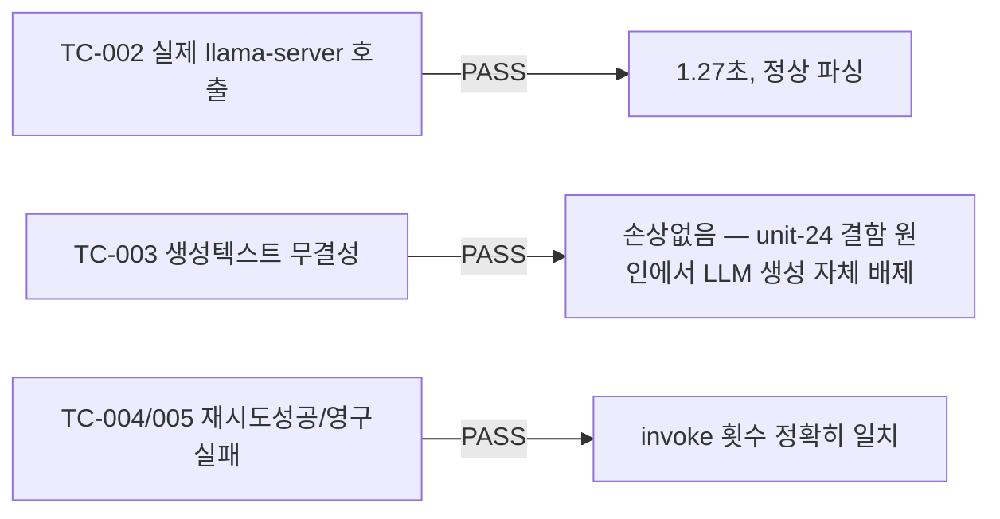

# unit-26 — LangChain 오케스트레이션 검증 모듈 (원안 §4.2)

- **작업일**: 2026-09-22 (git 커밋 20260923_1245)
- **소스 문서**: `docs/harness/units/unit-26-note.md`, `unit-26-test.md`
- **속도 트랙**: L1(표준 수준) · **판정**: PASS

## 스코프 결정

운영 파이프라인(`llm_engine.py`)은 이미 unit-7에서 11건 실측 결함을 거쳐 안정화됐고, 오늘 실제 장애가 있었던 모듈군과 같은 계열이라 **건드리지 않고 별도 검증 모듈로 실제 동작만 증명**. 프레임워크 전환 자체는 순수 리팩터링이라 실익 낮다고 판단(③ 매트릭스 기존 판단과 동일).

## 한 일

`langchain_orchestrator.py`(신규) — 기존 llama-server OpenAI 호환 엔드포인트를 `ChatOpenAI`로 감싸고, `llm_engine.py`가 이미 검증한 "JSON모드+수동파싱+1회재시도" 패턴 그대로 재사용.

## 검증 결과

## 영향받은 산출물

`backend/app/services/langchain_orchestrator.py`(신규, 운영 파이프라인 무변경).
