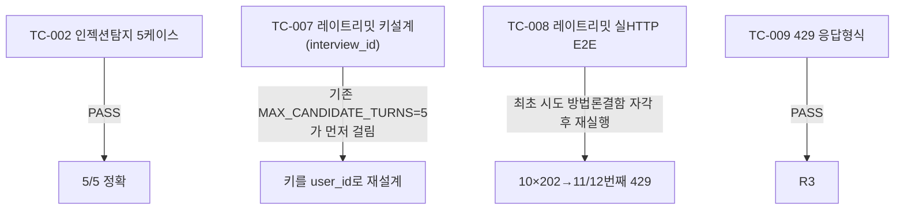

# unit-27 — AI 안전장치 5종 (REQ-035~039)

- **작업일**: 2026-09-22 (git 커밋 20260923_1245)
- **소스 문서**: `docs/harness/units/unit-27-note.md`, `unit-27-test.md`
- **속도 트랙**: L1(표준 수준) · **판정**: PASS

## 한 일

REQ-036(XSS 방지)/037(함수화이트리스트)는 기존 코드가 이미 충족함을 실측 확인(재구현 안 함). 신규: `prompt_safety.py` — REQ-035 인젝션탐지(차단 아닌 감사로그만), REQ-038 레이트리밋(분당10회), REQ-039 페르소나유출 감사로그.

## 검증 결과 (설계 재검토 1건 포함)

## 영향받은 산출물

`backend/app/services/prompt_safety.py`(신규), `interviews.py`/`worker/tasks.py`/`interview_prompts.py`(연결부 추가).
