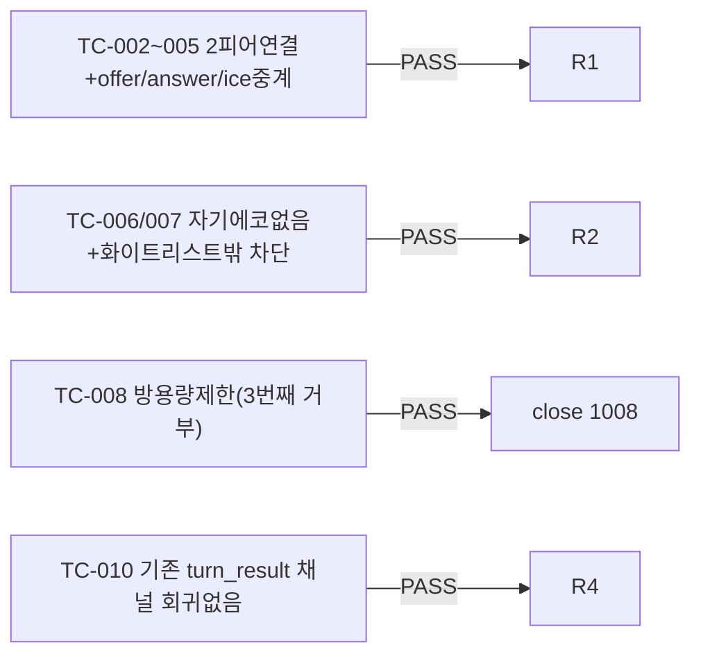

# unit-28 — WebRTC 시그널링 서버 (원안 §2.2/§4.1, 부분 구현)

- **작업일**: 2026-09-22 (git 커밋 20260923_1245)
- **소스 문서**: `docs/harness/units/unit-28-note.md`, `unit-28-test.md`
- **속도 트랙**: L1(표준 수준) · **판정**: PASS

## 정직한 스코프 선언

원안은 시그널링서버+미디어서버 2계층을 요구하지만 **시그널링(SDP/ICE 중계)만** 구현·검증. 미디어 서버(RTP 실제 수신)는 별도 대규모 작업(③매트릭스 "대")이고, 브라우저 자동화 도구가 없어 실제 미디어 협상을 검증할 방법이 없어 "구현했다고 주장하지 않는" 원칙 유지.

## 검증 결과 (10개 TC 전부 PASS)

## 영향받은 산출물

`backend/app/api/v1/webrtc_signaling.py`(신규).
