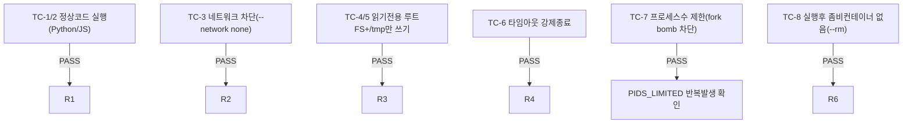

# unit-29 — 코드 실행 샌드박스 엔진 (원안 REQ-F-004, 2026-09-22 작성/2026-09-23 실측검증)

- **작업일**: 2026-09-22 작성, 2026-09-23 사용자 직접 실측 (git 커밋 20260923_2054)
- **소스 문서**: `docs/harness/units/unit-29-note.md`, `unit-29-test.md`
- **속도 트랙**: L1 · **판정**: 기능·보안 9원칙 실측 검증 완료 (API 배선은 당시 의도적 미배선 — 오늘 DEC-069로 배선 완료, `코드샌드박스배선` 파일 참고)

## 검증 방법의 특이점

이 세션(Claude Code) 자체는 플랫폼 안전장치로 코드 실행이 차단돼, **사용자가 직접 로컬 VS Code 터미널에서 `manual_sandbox_test.py`를 실행**해 검증(TC-1~8 전부 PASS).

## 검증 결과 (Docker 9중 격리 원칙 전부 실측 확인)

사용자가 격리 완화를 요청했으나 거절(DEC-060, 제3자 신뢰불가 코드를 실행하는 기능이라 위험 실질적) — 이 원칙은 오늘도 그대로 유지됨.

## 영향받은 산출물

`backend/app/services/code_sandbox.py`(신규, 당시 API 미배선).
