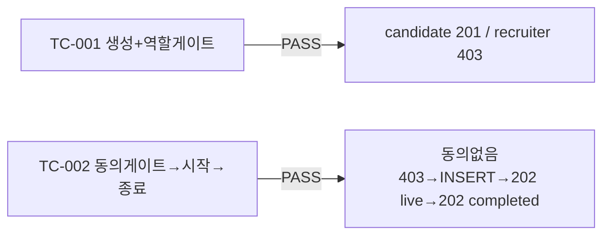

# unit-2 — 면접 세션 생성/시작/종료 (REQ-002, Feature B)

- **작업일**: 2026-09-19 07:34 (git 커밋 실제 시각)
- **소스 문서**: `docs/harness/units/unit-2-note.md`, `unit-2-test.md`
- **속도 트랙**: L1(경량, DEC-003) · **판정**: PASS

## 한 일

- `interviews`/`consents` 테이블 신설(Alembic `fdd74cee7615`, consents는 `/start` 동의게이트에 필요한 최소 스키마만)
- `POST /interviews`(candidate 전용, recruiter 403), `POST /interviews/{id}/start`(DEC-023 동의게이트: `ai_interview_notice`만 실시간 재조회 검사 → live 전환 + job enqueue 스텁), `POST /interviews/{id}/end`(completed 전환)
- 수평권한 검사(`_get_own_interview`)로 타인 세션 접근 403

## 검증 결과 (06단계 독립 재현)

| 항목 | 결과 |
|---|---|
| ruff | 0 에러 |
| 결함 | 0건 |

## 설계서 대비 편차(6건)

`rubric_template_id` FK 미설정(아직 대상 테이블 없음), consents 최소 스키마만 선구현(REST API는 unit-14/15 몫), job enqueue는 스텁(`job_queue.py`, 실제 AI워커는 이후 유닛), `/start`·`/end` 응답에 `interview` 필드 추가, `GET /interviews`(목록) 이번 범위 제외.

## 영향받은 산출물

`backend/app/{models/interview.py,models/consent.py,api/v1/interviews.py,services/job_queue.py}`, Alembic `fdd74cee7615_v2_interviews_and_consents`.
