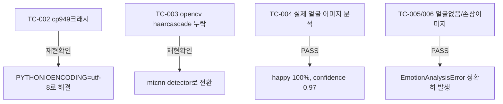

# unit-31 — DeepFace 표정 감정분석, 정지 이미지 (원안 REQ-018, 부분 구현)

- **작업일**: 2026-09-22 (git 커밋 20260923_1245)
- **소스 문서**: `docs/harness/units/unit-31-note.md`, `unit-31-test.md`
- **속도 트랙**: L1(표준 수준) · **판정**: PASS (⚠️ 법무 검토 필수, 서비스 미연결)

## ⚠️ 법적 경고

생체인식정보(민감정보) 처리, EU AI Act가 직장 내 감정인식을 금지관행으로 논의 중인 영역 — **배포 전 반드시 법무 검토 선행 필요**. 이 유닛은 "기술적으로 동작하는가"만 검증, 어떤 API 엔드포인트에도 연결하지 않음(오늘 DEC-070에서 "개인 PC 테스트 전용"으로 범위를 좁혀 배선됨 — `DeepFace배선` 파일 참고).

## 정직한 스코프

원안은 실시간 영상 스트림(초당1~2프레임+타임라인)을 요구했으나 그 전제(미디어서버)가 없어 **정지 이미지 1장→감정 확률 분포**만 구현.

## 검증 결과 (환경 특유 결함 2건 실측 후 해결)

## 영향받은 산출물

`backend/app/services/emotion_engine.py`(신규, 미연결).
