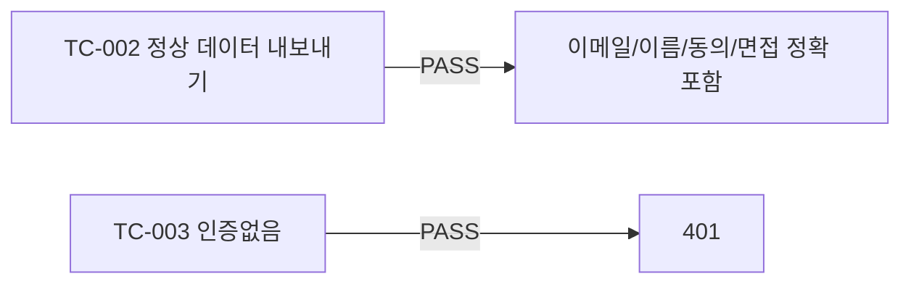

# unit-33 — GDPR/CCPA 갭 분석 + 데이터 이동권 기술 대응 (원안 REQ-028)

- **작업일**: 2026-09-22 (git 커밋 20260923_1245)
- **소스 문서**: `docs/harness/units/unit-33-note.md`, `unit-33-test.md`
- **속도 트랙**: L1(표준 수준) · **판정**: PASS

## 원칙

"GDPR/CCPA 준수"를 코드로 주장하지 않음 — 적법근거 체계·국외이전 안전조치·DPO 지정 여부는 법적 판단 영역(변호사 아님). 엔지니어 관점 갭 분석표만 작성.

## 한 일

갭 분석표(6개 영역: 동의수집/삭제요청/데이터이동권/국외이전/CCPA고지/DPO — 대부분 "법무판단 필요"로 명시) + `GET /users/me/data-export`(Art.20 데이터이동권, 신규 유일한 실제 구현분).

## 검증 결과

## 영향받은 산출물

`backend/app/{schemas/consent.py(DataExportOut 추가),api/v1/consents.py(GET/users/me/data-export)}`.
