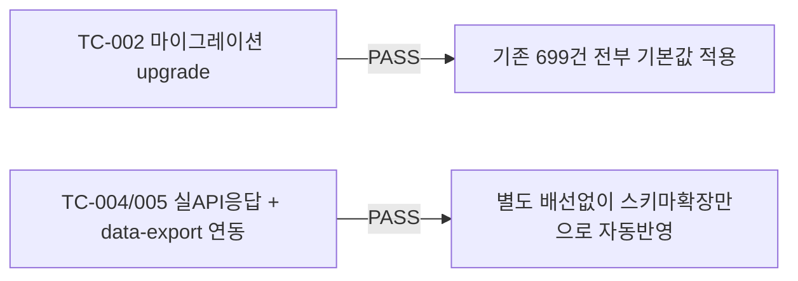

# unit-34 — GDPR 적법근거 필드 + CCPA 고지 + 법률고지 정합성 수정

- **작업일**: 2026-09-23 (git 커밋 20260923_1245)
- **소스 문서**: `docs/harness/units/unit-34-note.md`, `unit-34-test.md`
- **속도 트랙**: L1(표준 수준) · **판정**: PASS

## 한 일

`Consent.lawful_basis`(GDPR 제6조 6종, 기본값 consent) 신규 컬럼(기존 699건 자동 채움), CCPA "판매하지 않음" 고지 추가. **부수 발견**: unit-23이 추가한 `pass_fail_recommendation`으로 인해 법률고지 문구("합격/불합격 확정 기능 없음")가 실제 동작과 어긋나 있던 것을 발견해 즉시 수정("참고용 의견일 뿐" 문구로 교체).

## 검증 결과

unit-23이 겪은 "ENUM 타입 선행 생성 필요" 교훈을 미리 반영해 이번 마이그레이션은 처음부터 결함 없이 성공.

## 영향받은 산출물

`backend/app/{models/consent.py,schemas/consent.py}`, Alembic `d4f7b2c8a913_v14_consent_lawful_basis`, `frontend/lib/complianceContent.ts`(문구 정합성 수정).
