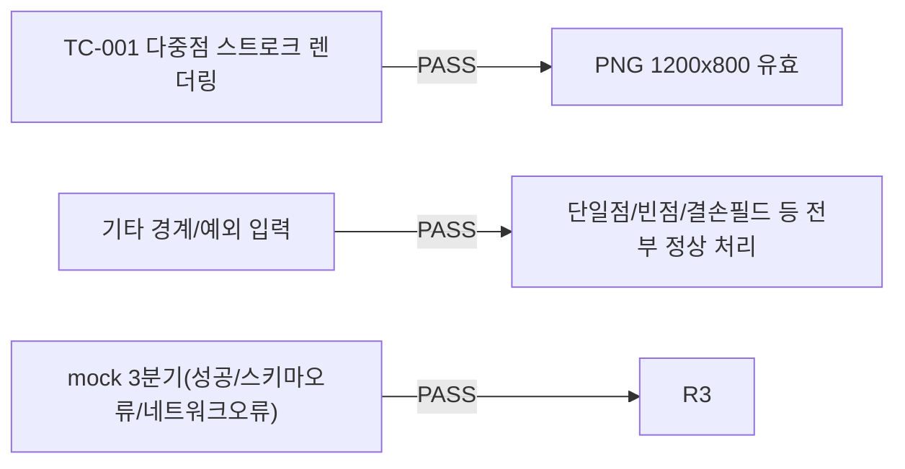

# unit-35 — 화이트보드 AI 비전 분석 (원안 REQ-021, 부분 구현)

- **작업일**: 2026-09-23 (git 커밋 20260923_2314)
- **소스 문서**: `docs/harness/units/unit-35-note.md`, `unit-35-test.md`
- **속도 트랙**: L1(표준 수준) · **판정**: PASS (당시 미배선. 오늘 DEC-061/062로 로컬 SmolVLM 실연결+실HTTP검증까지 완료 — `아티팩트재분류` 파일 참고)

## 배경

직전 세션이 코드(`whiteboard_vision.py`)만 만들고 06단계 결과서·decisions.md·traceability.md 반영 없이 중단(규칙 G/H 공백) — 이번 세션이 인계 확인+정식 검증.

## 한 일 (검증만, 코드는 인계분)

`render_strokes_to_png()`(순수 함수, Pillow) 실행 검증, `analyze_diagram_with_vision()`(GPT-4V 호출부, API키 없어 mock으로 파싱/에러변환 로직만 검증).

## 검증 결과

**DEF-001(Low, Fixed)**: `requirements.txt`에 Pillow 선언 누락 발견·수정.

## 영향받은 산출물

`backend/app/services/whiteboard_vision.py`(인계분 검증), `backend/requirements.txt`(Pillow 추가).
