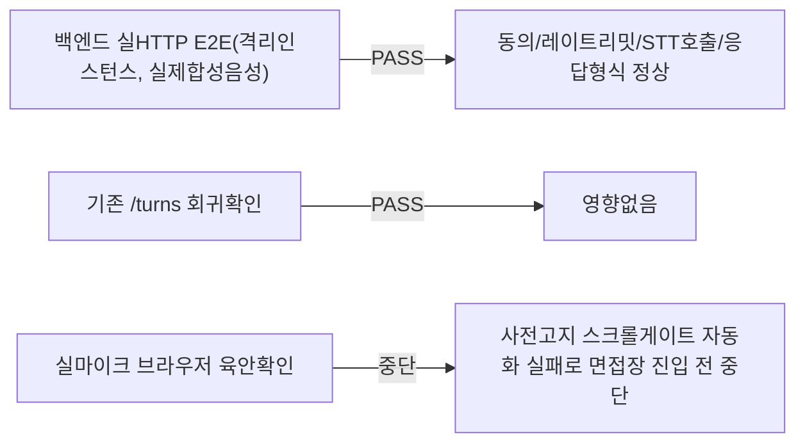

# unit-36 — STT 실시간 스트리밍 미리보기 (미니 세그먼트 방식)

- **작업일**: 2026-09-23 (git 커밋 20260923_1245)
- **소스 문서**: `docs/harness/units/unit-36-note.md`, `unit-36-test.md`
- **속도 트랙**: L2 · **판정**: 백엔드 PASS(실HTTP E2E), 프런트 브라우저 수동확인 미완(오늘 STT스트리밍검증 파일에서 재시도)

## 설계 결정

unit-24가 "오늘 실제 장애 있었던 코드 근처를 검증 도구 없이 재설계하는 위험"으로 보류했던 항목, 브라우저 도구 확보 후 재개(DEC-052). "청크 재조립"(WebM 헤더 문제로 복잡) 대신 **"미니 세그먼트"**(4초마다 완전히 독립된 WebM 파일) 채택 — 기존 `_submit_voice_turn`(오늘 장애났던 함수)은 **한 줄도 수정하지 않음**, 완전히 분리된 새 경로(`/turns/preview`, DB 미기록, job 큐 미사용).

## 한 일

`POST /interviews/{id}/turns/preview`(신규), 전용 레이트리밋(분당20회, 정식 턴 한도와 별도 Redis 키), 프런트 `runPreviewCycle`/`startPreviewLoop`.

## 검증 결과

## 영향받은 산출물

`backend/app/{api/v1/interviews.py(/turns/preview 추가),schemas/transcript.py(VoicePreviewResponse),services/prompt_safety.py(preview 레이트리밋)}`, `frontend/{lib/api.ts,app/interviews/[id]/page.tsx}`.
