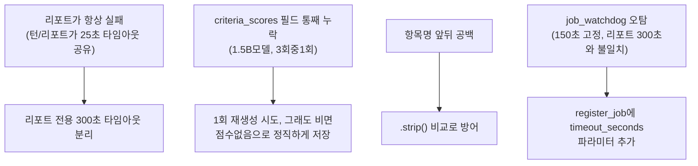

# unit-37 — 루브릭 템플릿 기반 항목별 채점 (REQ-010/012, 규칙 F 재작업)

- **작업일**: 2026-09-23 (git 커밋 20260923_2054)
- **소스 문서**: `docs/harness/units/unit-37-note.md`, `unit-37-test.md`
- **속도 트랙**: L3(정식) · **판정**: PASS — unit-10/11의 FAIL(DEF-001/002)을 실제로 해소

## 배경

unit-10/11(정적검토)이 FAIL 낸 "템플릿 미연결"/"근거 미노출"의 근본원인을 03/04 설계서 공백으로 판단(규칙F), 설계 재작업(DEC-054/055) 후 이번에 실제 구현.

## 한 일

`evaluation_reports`에 rubric_template_id/rubric_snapshot_json/criteria_scores_json 추가(시스템 기본 템플릿 시드 포함), 워커가 실제로 템플릿 기준을 프롬프트에 주입해 채점, `PUT /recruiter/interviews/{id}/rubric-template`(재지정→재채점), 프런트 `RubricEvidenceSection`(근거 화면 노출).

## 이 세션이 직접 구축한 실행 환경 (DEC-055)

Python 3.13/torch/llama.cpp Vulkan/Qwen2.5-1.5B/Piper/faster-whisper/Docker DB+Redis 전부 이 PC에 처음부터 새로 설치·기동해 실제 E2E 실행.

## 구현 중 발견·즉시 수정한 결함 4건

## 검증 결과

회원가입→면접→종료→리포트→재채점까지 실제 HTTP E2E, 서버 검증(템플릿에없는이름/범위밖점수/유효하지않은답변번호 배제), 가중평균, 권한경계(타recruiter/지원자 접근거부) 전부 PASS. 브라우저 렌더링(Playwright)은 이번 범위 밖.

## 영향받은 산출물

Alembic `e6a1b8f4d2c7_v15_rubric_scoring`, `backend/app/{services/rubric_defaults.py(신규),models/evaluation_report.py,services/llm_engine.py,services/interview_prompts.py,worker/tasks.py,api/v1/interviews.py,api/v1/recruiter.py,services/job_queue.py}`, `frontend/components/RubricEvidenceSection.tsx`(신규).
