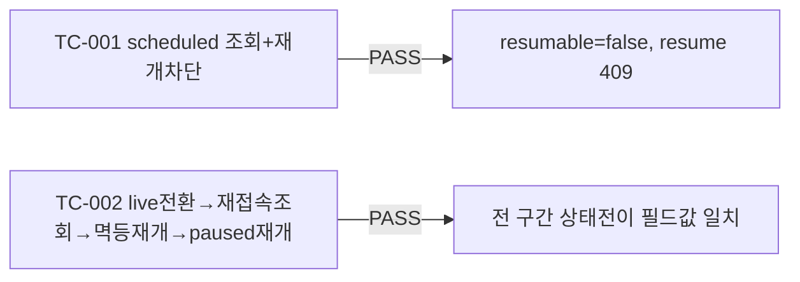

# unit-3 — 세션 중단/재접속 (REQ-013, Feature B)

- **작업일**: 2026-09-19 07:34 (git 커밋 실제 시각)
- **소스 문서**: `docs/harness/units/unit-3-note.md`, `unit-3-test.md`
- **속도 트랙**: L1(경량, DEC-003) · **판정**: PASS

## 한 일

- `GET /interviews/{id}`(신규, 상세조회 + 파생필드 `resumable`), `POST /interviews/{id}/resume`(live/paused만 허용, live는 멱등 200, scheduled/completed는 409, 만료 시 410)
- 세션 만료를 배치 잡이 아닌 **반응적(lazy) 판정**으로 구현(`_apply_lazy_expiry`, 24시간 임계값, DEC-026) — 조회 시점에 DB 반영
- `live→paused` 자동 전이 메커니즘은 설계서에 정의가 없어 이번 유닛에서 신설하지 않음(DEC-026, 향후 WS 게이트웨이 몫)

## 검증 결과 (06단계 독립 재현)

| 항목 | 결과 |
|---|---|
| ruff | 0 에러 |
| 결함 | 0건 |

## 규칙 A 관련(질문 없이 자체판단)

SESSION_EXPIRED 24시간 임계값(04-ux-design [C-12]가 05단계에 위임한 값), live→paused 전이 미구현(설계서 자체가 메커니즘 미정의 + 오케스트레이터가 폴백 경로 제시) — 둘 다 DEC-026에 근거 기록.

## 영향받은 산출물

`backend/app/api/v1/interviews.py`(GET/resume 추가), 신규 Alembic 리비전 없음(기존 컬럼만 활용).
