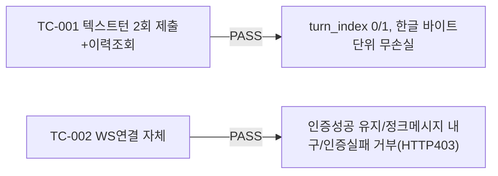

# unit-4 — 대화형 인터뷰 엔진: 텍스트 채팅 (REQ-003, Feature C)

- **작업일**: 2026-09-19 17:00 (git 커밋 실제 시각)
- **소스 문서**: `docs/harness/units/unit-4-note.md`, `unit-4-test.md`
- **속도 트랙**: L1 · **판정**: PASS

## 한 일

- `transcripts` 테이블 신설, `POST /interviews/{id}/turns`(텍스트 저장), `GET /interviews/{id}/transcripts`(신규)
- `/ws/interviews/{id}` WebSocket 게이트웨이 신규(쿼리 토큰 인증, 화이트리스트 메시지만 수신, `ConnectionManager.broadcast()`는 미래 AI Worker의 유일한 push 경로)
- AI 응답 생성(LLM)은 아직 없어 `enqueue_turn_job` 스텁만 — WS로 `stage_update`/`turn_result`는 이 유닛에서 영구히 오지 않음(정상, unit-7 몫)

## 검증 결과

관찰사항(결함 아님): WS 인증 실패 시 실제로는 코드주석의 "1008 정책위반 닫힘"이 아니라 HTTP 403 핸드셰이크 거절로 관측(Starlette/FastAPI가 accept 전 close 호출 시 프레임워크 동작) — 보안 목표는 정확히 달성됨.

## 부대 사건

06단계 검증 도중 **다른 병렬 세션이 공유 `.harness-tmp/` 디렉터리 전체를 삭제**하는 환경 이슈 관찰(이 유닛이 원인 아님, 오케스트레이터에 별도 공유).

## 영향받은 산출물

`backend/app/{models/transcript.py,api/v1/interviews.py,api/v1/ws.py,services/job_queue.py,schemas/transcript.py}`, `frontend/app/interviews/[id]/page.tsx`(신규), Alembic `0df1434883f2_v3_transcripts`.
