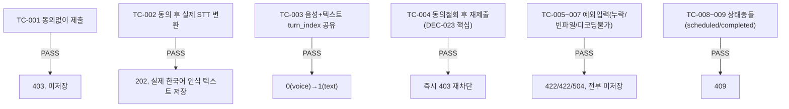

# unit-5 — 음성 턴제 STT 파이프라인 연동 (REQ-004/005, Feature C)

- **작업일**: 2026-09-19 17:00 (git 커밋 실제 시각)
- **소스 문서**: `docs/harness/units/unit-5-note.md`, `unit-5-test.md`
- **속도 트랙**: L1 · **판정**: PASS

## 한 일

- `stt_engine.py`(신규): faster-whisper(small/CPU/int8) 싱글턴, 오디오를 디스크에 쓰지 않고 메모리에서 바로 변환
- `POST /interviews/{id}/turns`를 텍스트/음성(multipart) 겸용으로 확장, `Content-Type`으로 분기
- **DEC-023 동의 게이트**: `biometric_voice` 동의를 매 요청 실시간 DB 재조회로 검사(캐시 없음) — 철회 시 즉시 차단

## 검증 결과 (9개 시나리오, 28개 단언, 2회 독립 실행 모두 PASS)

첫 실행에서 테스트 스크립트 자체의 단언 버그로 5건 FAIL이 나왔던 것을 원인 조사 후 스크립트를 고쳐 재실행, 28/28 PASS로 정정(테스트 설계 결함을 실제로 겪고 교정한 사례로 기록).

## 영향받은 산출물

`backend/app/services/stt_engine.py`(신규), `backend/app/api/v1/interviews.py`(음성 경로 확장), `backend/requirements.txt`(faster-whisper), `frontend/app/interviews/[id]/page.tsx`(AudioRecorderControl), `frontend/lib/api.ts`(submitVoiceTurn).
