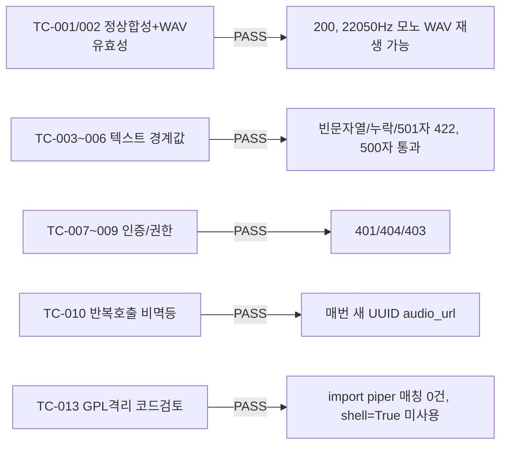

# unit-6 — 오픈소스 TTS(Piper) 연동 (REQ-006, Feature C)

- **작업일**: 2026-09-19 17:00 (git 커밋 실제 시각)
- **소스 문서**: `docs/harness/units/unit-6-note.md`, `unit-6-test.md`
- **속도 트랙**: L1 · **판정**: PASS

## 한 일

- `tts_engine.py`(신규): `ITTSEngine` 어댑터 + `PiperTTSEngine`. **DEC-017 GPL 격리 원칙**에 따라 Piper를 프로세스 내 import하지 않고 매 합성마다 서브프로세스(`python -m piper`)로 실행, 텍스트 파일→WAV 파일 인터페이스만 사용
- `POST /interviews/{id}/tts-preview`(신규, 진단용) + `/media` 정적 서빙 마운트
- 한국어 음성 `ko_KR-kss-medium` lazy 다운로드(1회, 63MB)

## 검증 결과 (14개 TC 전부 PASS)

편차: Piper를 상주시키지 않아 매 요청 2~4초 소요(STT처럼 "두 번째부터 빨라지는" 패턴 아님, §5.4 10초 타임아웃 예산 내이므로 결함 아님).

## 영향받은 산출물

`backend/app/services/tts_engine.py`(신규), `backend/app/api/v1/interviews.py`(tts-preview), `backend/app/main.py`(/media 마운트), `backend/requirements.txt`(piper-tts), `.gitignore`(backend/var/).
