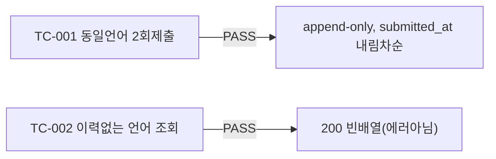

# unit-9 — 라이브 코딩: 에디터 + 제출/저장 API (REQ-008, Feature D)

- **작업일**: 2026-09-19 17:00 (git 커밋 실제 시각)
- **소스 문서**: `docs/harness/units/unit-9-note.md`, `unit-9-test.md`
- **속도 트랙**: L1 · **판정**: PASS

## 한 일

- `code_submissions` 테이블(append-only, 덮어쓰지 않음), `POST/GET /interviews/{id}/code-submissions`(GET은 DEC-024 갭3으로 신규)
- `CodeEditorPanel.tsx`(Monaco, 11개 언어) — **독립 컴포넌트로만 존재**, 아직 면접장 화면(`page.tsx`)에 배선되지 않음(추후 통합 유닛 몫, 오늘 DEC-069가 이 배선을 완료함)

## 검증 결과

관찰(unit-9 결함 아님): 병렬 진행 중이던 unit-5의 `stt_engine` 의존성 미완결로 앱 부팅이 일시 막혔던 공유 환경 이슈를 발견·우회.

## 영향받은 산출물

`backend/app/{models/code_submission.py,schemas/code_submission.py,api/v1/code_submissions.py}`, `frontend/app/interviews/[id]/components/CodeEditorPanel.tsx`(신규), Alembic `b84a71b986c5_v6_code_submissions`.
