# 계획서 산출물(Planning_Architecture) 13종 현재상태 전면 갱신

- **작업일**: 2026-09-25 10:26 (KST)
- **관련 결정 로그**: (별도 DEC 미부여 — 순수 문서 갱신, 코드 변경 없음)
- **요청 내용**: `00 파이널 프로젝트 계획서\Planning_Architecture_정찬성` 폴더의 문서 13종을 현재 개발상태 기준으로 전부 최신화.

## 배경

13개 문서는 이미 2026-09-23에 "Big20 예시 폐기 → 실제 프로젝트 기준 전면 재작성(v2.0.0)"이 1차로 완료된 상태였으나, 그 이후(09-24~25) 진행된 unit-29~37 실배선·실측검증, K8s 실배포검증, STT스트리밍 최종완료 등이 반영되지 않은 상태였음.

## 범위 확정 (사용자 확인)

13개 전부 갱신하되 성격이 다른 3개(transcripts_정확도.xlsx/PNG/브랜드로고)는 방식을 구분: 원본 실측 데이터는 보존하고 메타데이터·설명 텍스트만 갱신.

## 한 일 (append-only 방식, 기존 행/내용 삭제 없이 이어붙임)

```mermaid
flowchart TD
    A["WBS_업무관리"] --> A1["5.9 확장항목 비고 갱신, 개정이력 2.0.1"]
    B["Code_Dictionary"] --> B1["AST 재스캔 diff: 함수11/클래스4/파일3건 추가"]
    C["Test_버전관리대장"] --> C1["신규TC 5건(K8S-01 등), 기존행 완료전환 포인터"]
    D["주간보고"] --> D1["5차(09-24~25) 스프린트 신규"]
    E["시나리오기획서"] --> E1["SC-ROOM 2-3단계(코드실행/AI분석) 신규"]
    F["회의록"] --> F1["260924/260925 시트 신규"]
    G["파일관리대장"] --> G1["개발작업내용 54개 파일 등록 + PNG행 추가"]
    H["테스트케이스 xlsx+xlsm"] --> H1["TC-025~029 신규 + xlsm 불일치 발견·수정"]
    I["화면정의서(pptx)"] --> I1["슬라이드12 버튼반영, 개정이력 테이블 행추가"]
    J["테스트계획서(docx)"] --> J1["§3.6 신규 섹션 + §2 보강"]
    K["transcripts_정확도"] --> K1["메타데이터만(원본 측정치 무변경)"]
```

## 부수 발견 및 수정 — .xlsm/.xlsx 불일치

테스트케이스 `.xlsm` 파일이 2026-09-23 "전면교체" 작업에서 **실제로는 누락**되어 Big20 가상 데이터(작성자 "이승재" 등)가 그대로 남아있었음(파일관리대장에는 "전면교체 완료"로 잘못 기록). 사용자 확인 후 `.xlsx`와 동일한 실제 데이터(29행)로 동기화, VBA 매크로 프로젝트 자체는 무변경.

## 검증

모든 수정 파일(xlsx 9개, xlsm 1개, docx 1개, pptx 1개)을 openpyxl/python-docx/python-pptx로 재오픈해 손상 없음 확인.

## 영향받은 산출물

`00 파이널 프로젝트 계획서\Planning_Architecture_정찬성\` 내 13개 파일 전체(브랜드로고 폴더 제외).
