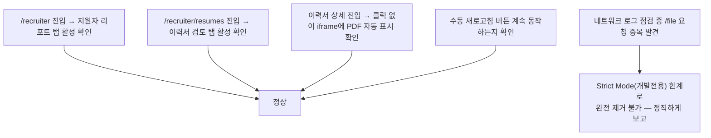

# 관리자 화면 — 목록 전환 탭 디자인 + 이력서 자동 미리보기

- **작업 일시**: 2026-09-30 (KST)
- **관련 DEC**: DEC-104 (`docs/harness/decisions.md`)

## 1. 무엇을 요청받았는가

1. "지원자 리포트 목록과 이력서 검토를 탭처럼 화면을 볼수 있도록 구분해 주세요.
   탭처럼 보이지 않으니 디자인적으로 애매합니다."
2. (같은 대화 중 추가) "해당 화면(이력서 상세)에서 이력서 미리보기 클릭하는거
   말고 바로 이력서 확인할 수 있도록 변경해줘."

## 2. 무엇을 했는가

### 2-1. 탭 디자인

직전 작업에서 `/recruiter` 화면 상단에 "이력서 검토" 메뉴를 추가했는데, 이게
`.submit-button` 스타일(큰 파란 사각 버튼)이라 제목 옆 액션 버튼처럼 보이고
"탭"으로 읽히지 않는다는 지적이었다. 새 CSS를 새로 설계하지 않고, 이
코드베이스에 이미 있던 면접장 보조패널 전환 탭 스타일(`.room-tab`/
`.room-tab--active`)을 그대로 재사용했다 — 일관된 디자인 시스템 유지가
목적이다.

- `frontend/components/RecruiterListTabs.tsx` 신설: `usePathname()`으로 현재
  경로를 비교해 "지원자 리포트"/"이력서 검토" 두 탭 중 활성 탭에
  `aria-current="page"`와 `room-tab--active` 스타일을 부여.
- `/recruiter`, `/recruiter/resumes` 두 화면 상단에 동일하게 배치.
- 대체된 기존 네비게이션 제거(중복이라 정리): `/recruiter`의 파란 버튼,
  `/recruiter/resumes` 하단의 "리포트 목록으로 돌아가기" 링크.

### 2-2. 이력서 자동 미리보기

`frontend/app/recruiter/resumes/[id]/page.tsx`에서 이력서 상세 데이터(`detail`)
로드가 끝나는 즉시 `handleDownload()`(기존 "이력서 미리보기" 버튼이 하던 일)를
자동으로 호출하는 `useEffect`를 추가했다. 버튼은 없애지 않고 수동 새로고침용
으로 남겼다(파일이 갱신됐을 때 다시 불러오는 용도).

## 3. 검증 — 실측, 그리고 한계를 숨기지 않고 보고

- 탭 활성 스타일: 활성 탭 배경색 `rgb(232, 238, 250)`, `aria-current="page"`
  속성을 두 화면 모두에서 실측 확인. 탭 클릭 없이 URL 직접 이동으로도
  양쪽 다 올바른 탭이 활성 표시됨.
- 자동 미리보기: 이력서 상세 페이지 진입 직후(버튼 클릭 전) `iframe`이 DOM에
  생성되고 `src`가 `blob:...`로 채워지는 것, 버튼 라벨이 곧바로 "이력서
  미리보기 새로고침"으로 바뀌는 것을 실측 확인 — 클릭 없이 자동으로 뜬다.
- **한계 발견·정직 보고**: 네트워크 로그를 보던 중 `/file` 엔드포인트가 같은
  페이지 진입에서 2번 호출되는 것을 발견. 원인은 React 18 Strict
  Mode(개발 서버 전용)가 컴포넌트를 마운트→언마운트→재마운트하면서
  이펙트를 두 번 실행하기 때문 — `useRef` 가드를 추가해봤지만, Strict
  Mode의 이중 마운트는 컴포넌트 인스턴스 자체를 새로 만들어 ref도 함께
  초기화되므로 완전히 막지 못하는 것을 재실측으로 확인했다. 모듈 스코프
  캐시로 강제로 막는 방법도 검토했으나, 그러면 "다른 이력서를 봤다가 이
  이력서로 돌아왔을 때 새로고침이 안 되는" 새로운 부작용이 생길 수 있어
  과잉엔지니어링으로 판단해 적용하지 않았다. **실제 영향**: `/file`은
  부작용 없는 조회 전용 GET이라 데이터 손상은 없고, 프로덕션 빌드에서는
  Strict Mode가 비활성화되어 이 중복 자체가 재현되지 않는다(DEC-064가
  이미 이 프로젝트에서 확립한 "Strict Mode 이중호출은 데이터 변경 부작용이
  있을 때만 적극 대응한다"는 기준과 동일하게 판단).

## 4. 뒷정리 (규칙 K) + 헬스체크 (규칙 K-6)

- `GET /api/v1/health` → `200 {"status":"ok"}`
- `GET /recruiter`(3001) → `200`, `GET /recruiter/resumes`(3001) → `200`

## 5. 영향받는 파일

- `frontend/components/RecruiterListTabs.tsx` (신규)
- `frontend/app/recruiter/page.tsx`
- `frontend/app/recruiter/resumes/page.tsx`
- `frontend/app/recruiter/resumes/[id]/page.tsx`
- `docs/harness/decisions.md` (DEC-104 신규)

git add/commit/push는 지시하신 대로 진행하지 않았습니다.
