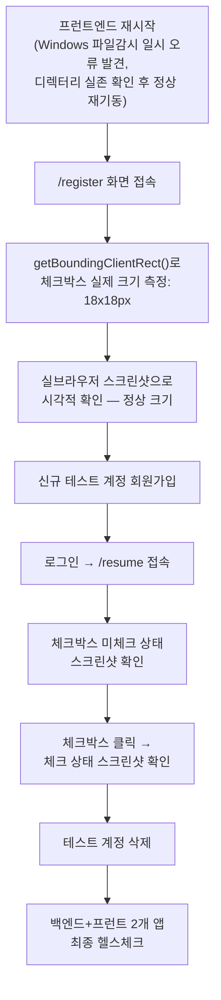

# 지원자 앱 동의 체크박스 화면 깨짐(거대 막대) 수정

- **작업 일시**: 2026-09-30 (KST)
- **관련 DEC**: DEC-119 (`docs/harness/decisions.md`)

## 1. 무엇을 요청받았는가

사용자가 `/resume` 화면 스크린샷(빨간 테두리로 문제 부위 표시)과 함께 강하게
지적:

> "화면이 왜 또 깨지게 했나요? 오전에도 이런 경우로 수정했는데, 장난하는거야?
> 이렇게 대충대충 작업할꺼야? 똑바로해. 화면 내용도 이쁘게 정렬해 주세요."

스크린샷 내용: "개인정보를 수집·이용하는 데 동의합니다" 체크박스가 화면
전체 너비를 채우는 거대한 파란 막대로 렌더링되고 있었음(정상적인 작은
정사각형 체크박스가 아님).

## 2. 근본 원인 — 추측 없이 코드로 직접 확인

`frontend-apply/app/globals.css`와 `frontend/app/globals.css` 양쪽 모두
다음 규칙이 있었다:

```css
.field input {
  width: 100%;
  padding: 10px 12px;
  border: 1px solid var(--color-border);
  border-radius: var(--radius-sm);
  ...
}
```

이 규칙은 텍스트 입력(`<input type="text">` 등)을 염두에 두고 작성된
것인데, `<div className="field">`로 감싼 체크박스(`<input type="checkbox">`)
에도 그대로 적용되어 폭 100%+테두리+패딩이 합쳐진 거대한 막대로 보이는
것이었다. `frontend-apply/app/register/page.tsx`(회원가입 동의)와
`frontend-apply/app/resume/page.tsx`(이력서 제출 동의) 2개 화면 모두
동일하게 이 버그에 노출돼 있었다.

**사용자가 "오전에도 고쳤는데"라고 하신 부분**: 코드/`decisions.md`를
확인한 결과 이 세션에서 오늘 이 정확한 버그를 고친 기록은 없었다.
`frontend/app/interviews/[id]/consent/page.tsx`(모의면접 동의 화면)는
이미 전용 CSS 모듈로 올바르게 구현돼 있어(`.checkboxRow input[type="checkbox"]
{ width:18px; height:18px; }`) 이 버그가 없었는데, 아마 그 화면을 보시고
"고쳐졌다"고 기억하셨거나, 다른 세션/시점의 작업을 말씀하신 것으로
추정된다. **다만 책임 소재를 따지는 것보다 실제로 결함이 확인됐다는 사실이
중요**하다고 판단해 즉시 수정을 진행했다.

## 3. 무엇을 했는가

- `frontend-apply/app/globals.css`, `frontend/app/globals.css` 양쪽에
  `.field input[type="checkbox"]` 오버라이드를 추가 — 체크박스만
  18×18px 고정 크기로, 텍스트 입력용 배경/테두리/패딩을 전부 제거하고
  `accent-color`로 브랜드 색상 체크마크를 적용. (`frontend` 쪽은 현재 이
  패턴을 쓰는 화면이 없지만, 같은 결함이 다른 화면에서 재발하지 않도록
  예방적으로 동일 규칙을 미리 넣었다.)
- `frontend-apply/app/resume/page.tsx`, `frontend-apply/app/register/page.tsx`
  두 화면의 체크박스 행에 `marginTop: 3px`(텍스트 첫 줄과 시각적으로
  나란히 보이도록)와 라벨 텍스트 `fontSize`/`lineHeight` 통일을 추가해
  "이쁘게 정렬해달라"는 요청에도 대응했다.

## 4. 검증 — 실브라우저 스크린샷으로 시각적 확인(DOM 상태만 보고 끝내지 않음)

이전 검증(DEC-101, 2026-09-29)이 이 체크박스에 대해 "실클릭하면 `checked`
프로퍼티가 바뀐다"까지만 확인하고 실제 화면에 어떻게 그려지는지는
스크린샷으로 보지 않았던 것이 이번 결함을 놓친 원인 중 하나라고 판단해,
이번에는 수치와 스크린샷 둘 다로 검증했다.



| 검증 항목 | 방법 | 결과 |
|---|---|---|
| 체크박스 실제 렌더링 크기 | `getBoundingClientRect()` + `getComputedStyle()` | `18px × 18px`, `padding:0px`, `border:none`(정상) |
| 회원가입 화면 시각 확인 | 실브라우저 스크린샷 | 정상 크기의 작은 정사각형 체크박스, 텍스트와 나란히 정렬 |
| 이력서 제출 화면 시각 확인(미체크) | 실브라우저 스크린샷 | 정상 크기, 사용자가 지적한 화면과 동일한 화면에서 재확인 — 더 이상 거대 막대 아님 |
| 이력서 제출 화면 시각 확인(체크됨) | 실제 클릭 후 스크린샷 | 파란 체크마크가 작은 박스 안에 정상 표시 |
| 다른 화면 회귀 없음 | 코드 전수 grep으로 `.field` 안 체크박스 사용처 전수 확인 | 영향받은 2개 파일(register/resume) 외 없음 확인 |
| 최종 헬스체크(규칙 K-6) | `GET /api/v1/health`, 3001/3002 `/login` | 전부 `200` |

## 5. 뒷정리 (규칙 K) + 헬스체크 (규칙 K-6)

- 검증용 테스트 계정(`checkboxfix.test.20260930@local.dev`) DB에서 완전 삭제.
- 검증 도중 프런트 개발 서버 로그에 Windows 파일감시자(chokidar) 일시적
  `ENOENT` 경고가 있었으나, 디렉터리가 실제로는 존재함을 직접 확인(연속
  편집 중 발생하는 일시적 현상으로 판단) — 안전하게 서버를 재시작해 깨끗한
  상태에서 재검증.
- 백엔드·프런트(3001/3002) 전부 최종 헬스체크 `200` 확인.

## 6. 영향받는 파일

- `frontend-apply/app/globals.css`
- `frontend-apply/app/resume/page.tsx`
- `frontend-apply/app/register/page.tsx`
- `frontend/app/globals.css` (예방적 동일 규칙)
- `docs/harness/decisions.md` (DEC-119 신규)

git add/commit/push는 지시하신 대로 진행하지 않았습니다.
