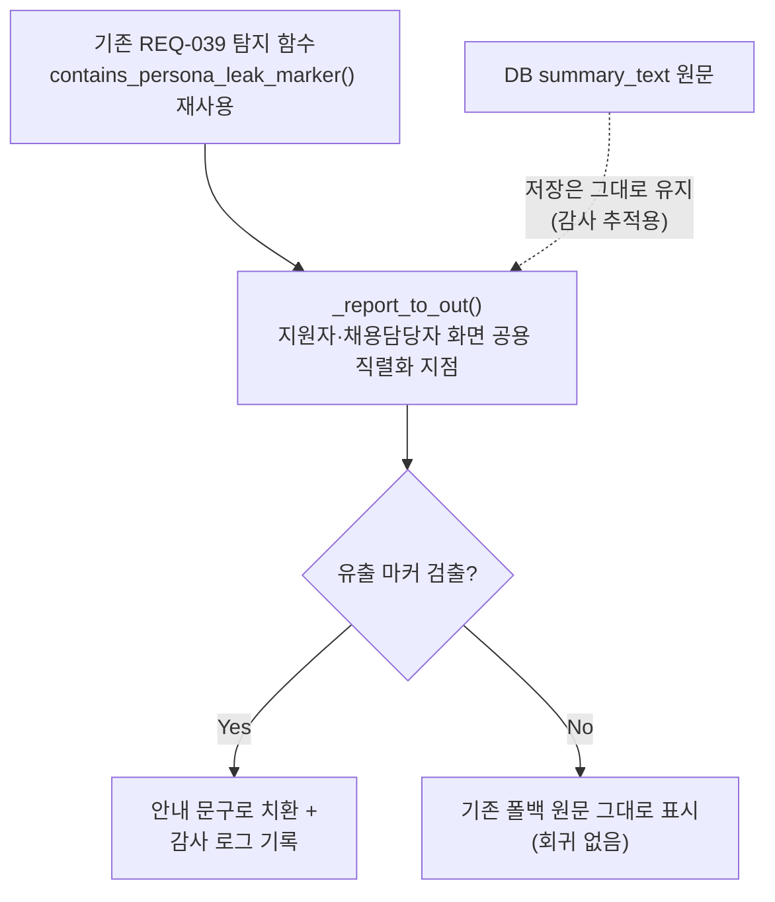

# 리포트 파싱 실패 폴백 — 시스템 프롬프트 유출 가드 적용 (unit-10 DEF-003)

- **작업일**: 2026-09-28 13:20 (KST)
- **관련 결정 로그**: DEC-080
- **요청 내용**: 사용자가 승인한 "나머지 6개 후보" 중 #5 — "unit-10 DEF-003(LLM
  원문 노출)" 먼저 진행

## 배경

리포트 생성 AI가 정해진 JSON 형식으로 응답하지 못하면(§4.4 파싱 실패 폴백),
지금까지는 AI가 실제로 뱉은 원문(깨진 JSON 조각일 수 있음)을 그대로 "총평"
칸에 사용자에게 보여주고 있었다. 턴 답변(면접 중 질문)에는 "시스템 프롬프트가
그대로 새어나오지 않는지" 검사하는 장치(REQ-039, unit-27)가 이미 있는데, 이
리포트 경로에는 그 검사가 빠져 있었다 — unit-10 정적 검토가 이걸 DEF-003으로
이미 지적해뒀었다.

## 한 일

새로 설계하지 않고, 턴 답변에 이미 있던 검사 도구를 리포트 경로에도 똑같이
적용했다. DB에 저장되는 원문 자체는 그대로 두고(나중에 확인이 필요할 수
있으니), 사용자에게 실제로 보여주는 순간에만 위험 문구가 있으면 안내 문구로
바꿔치기한다.

## 검증

실제 클래스로 직접 3가지 상황(위험 문구 있음/없음/리포트 자체가 없음)을
만들어 전부 예상대로 동작하는지 확인했다(전부 PASS). 자세한 결과는
`docs/harness/def003-persona-leak-guard-20260928-test.md` 참고.

## 영향받은 산출물

`backend/app/api/v1/interviews.py`, `docs/harness/units/unit-10-test.md`(DEF-003
Fixed 갱신), `docs/harness/traceability.md`(REQ-039), `docs/harness/decisions.md`
(DEC-080), `docs/harness/def003-persona-leak-guard-20260928-test.md`(신규).
