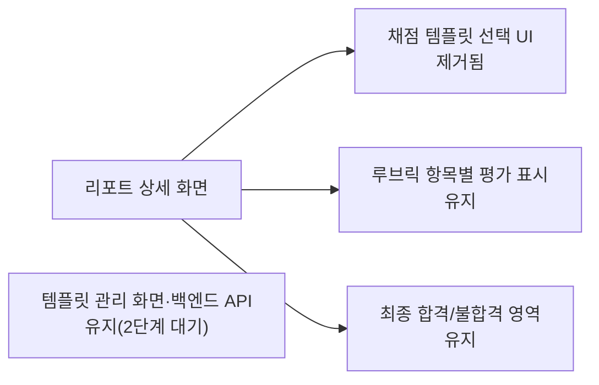

# 리포트 상세 "채점 템플릿 / 이 템플릿으로 다시 채점" UI 제거

- **작업 일시**: 2026-10-07 (KST)
- **관련 DEC**: DEC-121 (`docs/harness/decisions.md`)
- **상세 테스트 결과서**: `docs/harness/units/recruiter-remove-rerate-ui-test.md`

## 1. 무엇을 요청받았는가

스크린샷의 빨간 박스("채점 템플릿" 선택 + "이 템플릿으로 다시 채점" 버튼)에 대해 "이 기능 자체가 의미가 없습니다. 기본 1개만 필요합니다."

**착수 전 확인(규칙 A)**: 이 기능은 화면·템플릿 관리 화면·백엔드 API·채점 로직 4개 층에 걸쳐 있어 범위를 질문했고, **"1단계: 화면만 제거"**로 확정했다.

## 2. 무엇을 했는가

- `frontend/app/recruiter/[id]/page.tsx`: 채점 템플릿 selectbox, "이 템플릿으로 다시 채점" 버튼, 확인/취소 문구, 관련 상태·핸들러, 템플릿 목록 호출 제거(약 100줄 삭제).
- **유지한 것**: "루브릭 항목별 평가"(기본 루브릭 채점 결과) 표시, 템플릿 관리 화면과 백엔드 API, 재채점 큐, 채점 로직.
- `frontend/e2e/recruiter-final/no-rerate.spec.ts` 신규(4건).

## 3. 검증

| 항목 | 결과 |
|---|---|
| 템플릿 UI 부재 / 템플릿 API 미호출 | 통과 |
| 기본 루브릭 항목별 평가 표시 유지 | 통과 |
| 최종 합격/불합격 영역과 공존, 콘솔 오류 0 | 통과 |
| 전체 E2E 33건, 3회 반복 99건 | 전부 통과 |
| tsc / eslint / next build | 오류 0 |

## 4. 영향받는 파일

- `frontend/app/recruiter/[id]/page.tsx`
- `frontend/e2e/recruiter-final/no-rerate.spec.ts` (신규)
- `docs/harness/units/recruiter-remove-rerate-ui-test.md` (신규), `docs/harness/decisions.md` (DEC-121)

## 5. 남은 일

- 2단계(템플릿 관리 화면·백엔드 API·관련 테스트 제거)는 요청하시면 별도 작업으로 진행한다. 기존 테스트·마이그레이션 이력(v7, v15)·이미 채점된 데이터 영향 검토가 필요하다.
