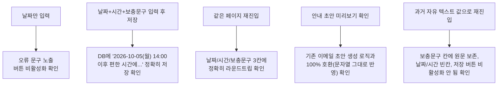

# 면접 일정 안내 — 자유 텍스트 → 날짜/시간 선택 UI

- **작업 일시**: 2026-09-30 (KST)
- **관련 DEC**: DEC-105 (`docs/harness/decisions.md`)

## 1. 무엇을 요청받았는가

관리자(채용담당자) 이력서 상세 화면의 "면접 일정 안내" 입력칸이 자유 텍스트
한 줄(placeholder로만 "2026-10-05(월) 14:00 이후 편한 시간에..." 형식을
암시)이었는데, "날짜는 선택하도록 해주세요. 시간도 선택할 수 있도록 수정해
주세요"라는 요청을 받았다.

**착수 전 확인한 설계 결정 (AskUserQuestion, 임의 진행 금지 원칙에 따라)**:

1. 날짜+시간을 선택 UI로 바꾸면서 기존처럼 "~이후 편한 시간에 진행해주세요"
   같은 보충 설명 문장도 계속 쓸 수 있어야 하는지 → **"함께(권장)"** 선택.
2. 시간까지 반드시 골라야 하는지, 아니면 날짜만 고르고 시간은 비워둘 수도
   있는지 → **"날짜와 시간 둘 다 필수"** 선택.

## 2. 무엇을 했는가

`frontend/app/recruiter/resumes/[id]/page.tsx`에서:

- 단일 텍스트 상태(`scheduleNote`)를 3개로 분리: `scheduleDate`
  (`<input type="date">`), `scheduleTime`(`<input type="time">`),
  `scheduleExtra`(보충 문구, 여전히 자유 텍스트).
- 백엔드 스키마는 건드리지 않았다 — `interview_schedule_note`는 여전히
  단일 텍스트 컬럼이라, 프런트에서 `composeScheduleNote()`로
  `"YYYY-MM-DD(요일) HH:MM 보충문구"` 형식 문자열을 만들어 기존 API에
  그대로 저장한다(DB 마이그레이션 없음, 최소 변경).
- `parseScheduleNote()`로 이 형식과 일치하는 기존 값은 재편집 시 날짜/
  시간/보충문구 3칸으로 정확히 되돌린다(라운드트립). 이 형식이 아닌
  과거 자유 텍스트는 안전하게 보충문구 칸에 그대로 두고 날짜/시간은
  비워둔다 — 잘못 쪼개서 보여주는 것보다 원문 보존을 우선했다.
- "날짜와 시간 둘 다 필수" 규칙: 날짜만 있고 시간이 없거나 그 반대인
  상태(`scheduleIncomplete`)에서는 인라인 오류 문구를 보여주고 "합격
  처리"/"불합격 처리" 버튼을 비활성화한다.

## 3. 검증 — 4가지 시나리오 전부 실브라우저로 실측

| 시나리오 | 확인 방법 | 결과 |
|---|---|---|
| 날짜만 입력(시간 없음) | JS로 버튼 `disabled` 속성 확인 | `true`, 오류 문구 "면접 날짜와 시간을 모두 입력해주세요." 노출 |
| 날짜+시간+보충문구 저장 | `합격 처리` 클릭 후 DB 직접 조회 | `2026-10-05(월) 14:00 이후 편한 시간에 모의면접을 진행해주세요.` |
| 재진입 라운드트립 | 페이지 재로드 후 각 input의 `.value` 확인 | date=`2026-10-05`, time=`14:00`, extra=`이후 편한 시간에 모의면접을 진행해주세요.` |
| 안내 초안 미리보기 | "안내 내용 미리보기" 클릭 후 렌더링 텍스트 확인 | "면접 일정 안내: 2026-10-05(월) 14:00 이후 편한 시간에 모의면접을 진행해주세요." 그대로 반영 |
| 과거 자유 텍스트 하위호환 | DB에 직접 `'다음 주 중 편한 시간에 연락 부탁드립니다.'` 주입 후 재진입 | date="", time="", extra="다음 주 중 편한 시간에 연락 부탁드립니다.", 버튼 비활성화 안 됨(정상) |

## 4. 뒷정리 (규칙 K) + 헬스체크 (규칙 K-6)

- 테스트에 사용한 이력서 신청 1건을 `pending`/모든 판단 필드 `NULL`로 원복.
- `GET /api/v1/health` → `200 {"status":"ok"}`, 상세 페이지 → `200`.

## 5. 영향받는 파일

- `frontend/app/recruiter/resumes/[id]/page.tsx`
- `docs/harness/decisions.md` (DEC-105 신규)

git add/commit/push는 지시하신 대로 진행하지 않았습니다.
