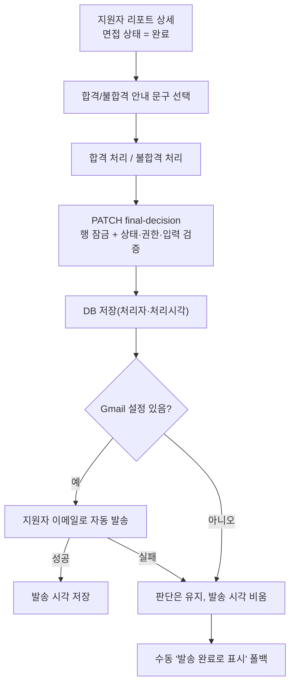

# 면접 완료 건 최종 합격/불합격 처리 + 안내 메일 자동 발송

- **작업 일시**: 2026-10-07 (KST)
- **관련 DEC**: DEC-120 (`docs/harness/decisions.md`), 기준 구현 DEC-116
- **상세 테스트 결과서**: `docs/harness/units/recruiter-final-decision-test.md`

## 1. 무엇을 요청받았는가

지원자 리포트 목록에서 면접 상태가 **완료**인 건을 열면, 이력서 합격 처리와 같은 방식의 **최종 합격/불합격 처리**를 추가해달라는 요청이다. 합격 여부 안내를 이메일(MCP 포함 표현)로 보내는 로직은 이력서 합격 처리와 모두 동일해야 한다.

**착수 전 확인(규칙 A, 임의 진행 금지)** — 4건을 질문해 모두 권장안으로 확정했다.

| 질문 | 결정 |
|---|---|
| 메일 문구 | 최종 합격/불합격 **전용** 문구로 새로 작성 (서류 전형 문구 재사용 안 함) |
| 안내 문구 드롭다운 | 최종용 문구 목록 신규 작성(초안 3개씩, 확인 후 수정 가능) |
| 면접 일정 입력(날짜/시/분/참고) | **제외** |
| 처리 후 변경 | **한 번 처리하면 변경 불가** |

"MCP"는 이력서 처리와 동일하게 **Gmail SMTP 자동 발송**으로 구현했다. 배포된 백엔드는 MCP 도구를 직접 호출할 수 없어 DEC-116 에서 SMTP 를 채택한 바 있다.

## 2. 무엇을 했는가

- **DB**: `interviews` 에 `final_decision`(enum), `final_decision_note`, `final_decided_by`(FK), `final_decided_at`, `final_notified_at` 추가. 마이그레이션 `a5d2c8e1f7b3`(기존 행은 모두 NULL).
- **백엔드**: 신규 `recruiter_final_decision.py` — `PATCH /recruiter/reports/{id}/final-decision`, `GET .../final-notification-draft`, `POST .../final-mark-notified`. 리포트 상세 응답에 최종 결정 필드 4개 추가.
- **프런트**: `/recruiter/{id}` 에 "최종 합격/불합격 결정"(문구 드롭다운 2개 + 합격/불합격 버튼)과 "최종 합격/불합격 안내"(미리보기, 안내 완료 시각, 수동 발송 완료) 영역 추가. 면접 `완료` 건에만 표시.
- **보안·안정성**: recruiter 권한만, `completed` 상태만, 문구 1~500자(앞뒤 공백 제거), 행 잠금으로 동시 요청 시 1건만 성공·메일 1회, 처리자·처리시각 기록, 발송 성공 시에만 발송 시각 기록(보낸 척 금지).

## 3. 검증

| 항목 | 결과 |
|---|---|
| 백엔드 pytest(실제 PostgreSQL + HTTP 서버 + 프로세스 내 메일 가짜) | 36건 통과 (신규 30 + 스모크 6) |
| 프런트 E2E(3회 반복) | 87건 통과 (신규 12시나리오 + 상태 필터·탭 순서 회귀) |
| 마이그레이션 | 기존 데이터가 있는 DB 에서 up → down → up 성공 |
| 동시 요청 | 2건 동시: 200 1 + 409 1 / 4건 동시: 메일 정확히 1회 |
| 정적 검사 | tsc, eslint, ruff 변경 파일 오류 0 |
| 발견·수정한 결함 | 공백 포함 500자 문구 거부(DEF-001) 1건 수정 |

## 4. 영향받는 파일

- `backend/alembic/versions/a5d2c8e1f7b3_v18_interview_final_decision.py` (신규)
- `backend/app/api/v1/recruiter_final_decision.py` (신규)
- `backend/app/api/v1/recruiter.py`, `backend/app/main.py`, `backend/app/models/interview.py`, `backend/app/schemas/recruiter.py`
- `backend/tests/final_decision/` (신규 테스트 3파일)
- `frontend/app/recruiter/[id]/page.tsx`, `frontend/lib/api.ts`
- `frontend/e2e/recruiter-final/final-decision.spec.ts` (신규)
- `docs/harness/units/recruiter-final-decision-test.md` (신규), `docs/harness/decisions.md` (DEC-120)

## 5. 사용자 환경에서 꼭 해야 할 일

1. **로컬 DB 마이그레이션 적용**: `cd backend && alembic upgrade head` (적용 전에는 리포트 상세 조회가 오류).
2. 백엔드 재시작 후 완료 건 1개로 실제 처리해 **Gmail 메일 도착 확인**.
3. 안내 문구 초안(3개씩) 확인 — 바꾸려면 `frontend/app/recruiter/[id]/page.tsx` 상단의 두 배열만 수정.

## 6. 참고

- 이 세션은 사용자의 로컬 DB·Gmail 에 접근할 수 없어 실제 DB 적용과 실제 메일 발송은 하지 못했다. 대신 임시 PostgreSQL 과 메일 함수 가짜로 검증했다.
- 처리 결과는 변경할 수 없으므로 잘못 처리한 건은 DB 에서 직접 정정해야 한다.
