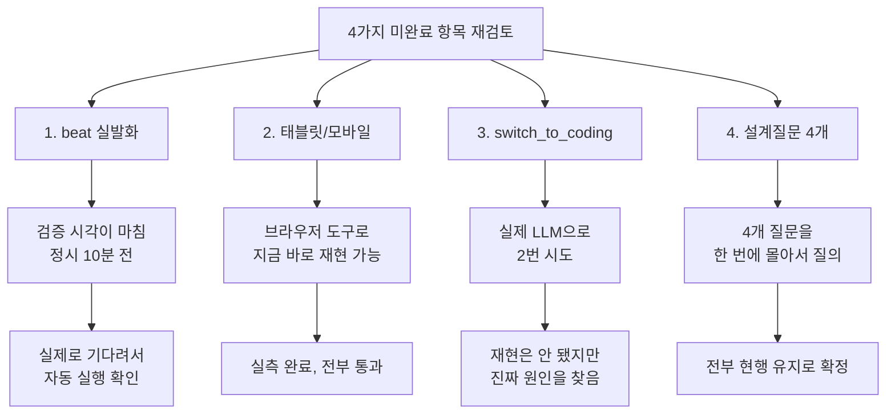

# 미완료 항목 재검토 — beat 실발화, 태블릿/모바일, switch_to_coding, 설계질문 4개

- **작업일**: 2026-09-28 21:05 (KST)
- **관련 결정 로그**: DEC-094
- **요청 내용**: 직전 작업(unit-21 자동 파기 배치 + weight 검증)에서 "부분착수"로
  표시했던 항목들에 대해, 사용자가 "미완료건 처리가능한지 검토해 주세요. 2번
  작업 요청시키게 하지 말고" 지시.

## 배경

직전 보고에서 "완료가 아니라 부분착수"라고 정직하게 밝힌 4가지가 있었다:
(1) 자동 파기 배치가 정말로 저절로 실행되는지, (2~3) 화면 배선(unit-20)의
태블릿/모바일 화면과 AI가 자동으로 화면을 전환하는 기능, (4) 아직 답이 안 나온
설계 질문 4개. "부분착수"라고만 하고 끝내지 않고, 정말로 지금 처리할 수 있는지
다시 한번 따져봤다.

## 한 일과 발견

### 1. 자동 파기 배치가 정말 저절로 실행되는가

전에는 "몇 시간 기다려야 해서 확인 못 했다"고 했는데, 다시 보니 확인을 시작한
시각이 마침 정각(21:00) 10분 전이었다. 그래서 실제로 삭제 요청 1건을 미리
만들어두고, 스케줄러를 진짜로 띄운 채 10분을 기다렸다. **정확히 21시 0분 6초에,
내가 아무 것도 누르지 않았는데 시스템이 스스로 그 요청을 처리했다.** 이걸로
"코드만 맞고 실제로 동작하는지는 모른다"는 걱정이 완전히 해소됐다.

### 2. 태블릿/모바일 화면

브라우저 도구로 화면 크기를 태블릿(768px)·모바일(375px)로 바꿔가며 실제로
클릭해봤다. 둘 다 원래 설계된 대로 정확히 동작했다(태블릿은 1:1 분할, 모바일은
전체화면으로 뜨고 뒤로가기 버튼 누르면 원래 탭으로 포커스가 돌아옴). 이건
2026-09-20에 코드를 짠 사람이 혼자 확인한 이후로 아무도 다시 확인한 적이 없던
부분이었다.

### 3. AI가 스스로 코드 화면으로 전환하는 기능

지원자가 "코드로 보여드릴까요?"라고 답하면 AI가 알아서 화면을 코드 에디터로
전환해주는 기능이 있는데, 이게 실제로 동작하는 걸 이 프로젝트 역사상 한 번도
확인한 적이 없었다. 실제 AI를 살려놓고 두 번 시도해봤다 — 한 번은 자연스럽게,
한 번은 아예 그 기능 이름(`switch_to_coding`)까지 답변에 적어서. **두 번 다
전환되지 않았다.** 그런데 여기서 그냥 "안 되네요"로 끝내지 않고 원인을 찾아봤다
— AI에게 내리는 지시문(시스템 프롬프트)을 읽어보니, "이 상황에서 화면을
전환하라"는 지시 자체가 애초에 한 번도 적혀있지 않았다. 즉 이건 버그가 아니라
"아직 구현이 덜 된 지시문"이라는 걸 확인했다.

### 4. 답이 안 나왔던 설계 질문 4개

계정 전체 탈퇴 기능을 새로 만들지, 면접 준비 화면을 새로 만들지, 화면 배치를
어떻게 할지 등 네 가지 질문을 한 번에 모아서 여쭤봤다. **전부 "지금 그대로
유지"로 답을 주셔서, 더 이상 "미해결"이 아니라 "그대로 두기로 확정"된 상태가
됐다.**

## 영향받은 산출물

`docs/harness/deletion-batch-weight-validation-20260928-test.md`(beat 실발화
TC 추가), `docs/harness/units/unit-20-test.md`(B5/B6 PASS 전환, B7 원인규명,
Q1~Q4 종결, 결론 갱신), `docs/harness/traceability.md`(REQ-030/008/015/017),
`docs/harness/decisions.md`(DEC-094), `.gitignore`(beat 로컬 상태파일 패턴
추가).
