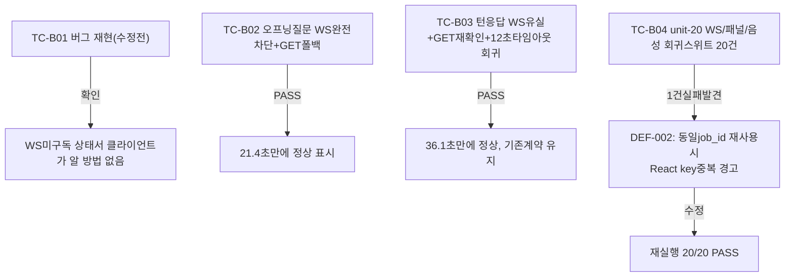

# 버그수정 — AI 응답 WS 유실 시 GET 폴백 복구

- **작업일**: 2026-09-22 (git 커밋 실제 시각)
- **소스 문서**: `docs/harness/units/bugfix-20260922-ws-fallback-test.md`
- **판정**: PASS (진행 중 새 결함 1건 발견·즉시수정)

## 배경

사용자 리포트("면접장 진입 시 첫 질문 후 반응 없음", "음성 답변 후 문제") 실제 원인 재현·수정.

## 한 일

오프닝 질문/턴 응답이 WS로만 전달되던 것에 **GET 폴백**(3초 간격, 최대 45초) 추가 — WS가 완전히 유실돼도 화면이 영구 대기하지 않도록.

## 검증 결과

## 영향받은 산출물

`frontend/app/interviews/[id]/page.tsx`(GET 폴백 로직 신설, WS 키 유일성 수정).
