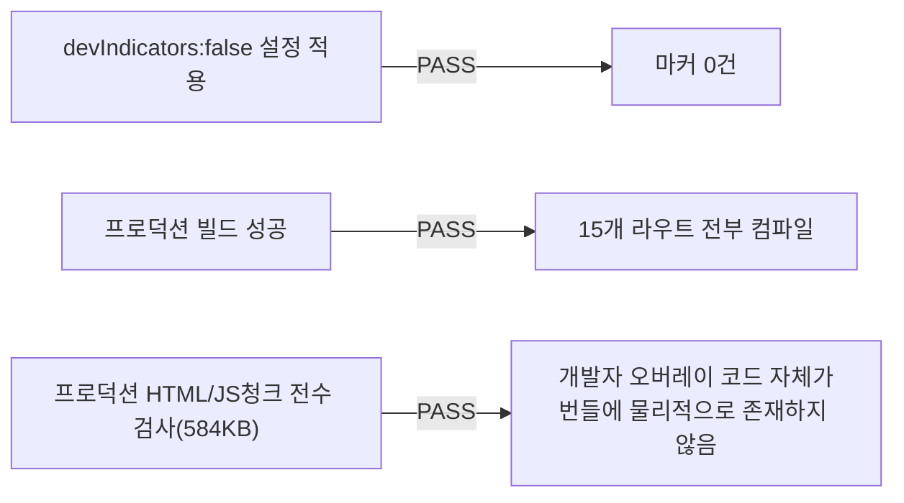

# 버그수정 — 개발 모드 디버그 배지 프로덕션 미노출 검증

- **작업일**: 2026-09-22 (git 커밋 실제 시각)
- **소스 문서**: `docs/harness/units/bugfix-20260922-dev-indicator-test.md`
- **판정**: PASS

## 배경

사용자가 개발 모드 전용 디버그 배지("N"/오류 아이콘)가 "모든 사용자에게 전혀 보이지 않도록" 확답을 요구.

## 검증 결과 (추측이 아닌 실제 빌드 산출물 검사)

"확률적으로 안 보임"이 아니라 "코드가 없어 구조적으로 보일 수 없음"을 직접 증거로 확정.

## 영향받은 산출물

`frontend/next.config.mjs`.
