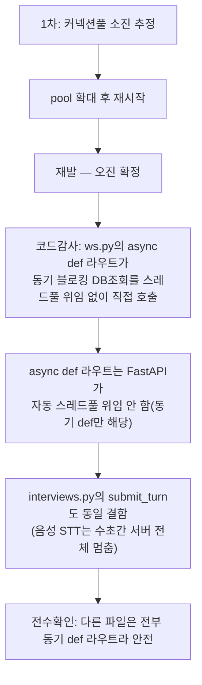

# 버그수정 — 백엔드 전체 응답불능(이벤트 루프 블로킹) 근본원인 수정

- **작업일**: 2026-09-22 (git 커밋 실제 시각)
- **소스 문서**: `docs/harness/units/bugfix-20260922-event-loop-hang-test.md`
- **판정**: PASS

## 배경

"백엔드가 살아있으나 어떤 요청에도 응답 안 함" 장애가 반복 재발. 1차 조치("DB 커넥션 풀 확대")는 재발로 오진 확정됨.

## 근본원인 조사 경과

## 검증 결과

수정 후 이전보다 강한 동시부하에서도 무응답 재발 없음 실측 확인, 리포트 생성/열람 기능 회귀 없음 재검증.

## 영향받은 산출물

`backend/app/api/v1/{ws.py,interviews.py}`(블로킹 호출을 스레드풀 위임으로 수정).
