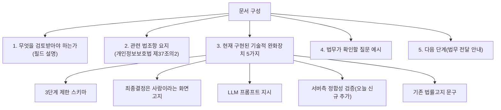

# 합격/불합격 필드 법무 검토 요청 브리핑 작성

- **작업일**: 2026-09-28 12:02 (KST)
- **관련 결정 로그**: DEC-079
- **요청 내용**: 사용자가 승인한 보강 작업 3건(1→6→8) 중 3번째 — "합격/불합격
  필드 법무 검토 요청 안내"

## 배경

unit-23(2026-09-22)이 "합격/불합격" 참고 의견 필드를 추가하면서 "배포 전
법무 검토 필수"라고 코드 곳곳에 남겼는데, 그 이후 실제로 법무 자문을 요청한
적은 한 번도 없었다.

## 한 일

저는 법무 자문을 해드릴 수 없어서, 실제 변호사/법무팀에게 그대로 전달할 수
있는 브리핑 문서(`docs/legal/pass-fail-recommendation-review-brief.md`)를
작성했다. 내용은:

## 중요한 원칙

이 문서 어디에도 "이건 문제없다"거나 "이렇게 하면 안전하다"는 제 판단을
넣지 않았다 — 사실관계(어떤 기능인지, 무엇을 이미 해뒀는지)만 정리하고,
최종 판단은 전부 법무에 맡겼다.

## 영향받은 산출물

`docs/legal/pass-fail-recommendation-review-brief.md`(신규), `docs/harness/
decisions.md`(DEC-079).
