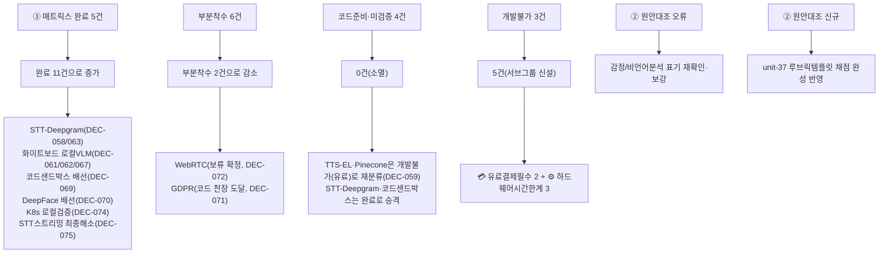

# 스펙 비교 아티팩트 링크 복구 및 DEC-053~075 전면 반영

- **작업일**: 2026-09-28 11:02 (KST)
- **관련 결정 로그**: DEC-076
- **요청 내용**: "현재 프로젝트 기준으로 아티팩트 모의면접 파일 최신 버전으로 업데이트 해줘. 20년차 기준으로"

## 문제 발견

CLAUDE.md가 정본으로 지정해둔 아티팩트 링크(`XXtdDuT4TovCtAMarPmw4i`, 2026-09-25
세션까지 갱신되던 것)를 이 세션 계정에서 열 수 없었다 — "찾을 수 없음"(삭제됐거나
다른 계정 소유). 사용자에게 확인한 뒤, 이 세션이 실제로 편집 권한을 가진 기존
링크(`JWSb8Z6zfY43r6UqBE1ASS`, 2026-09-23까지만 갱신되고 그 뒤로는 방치돼 있던
것)를 정본으로 채택하기로 확정했다.

## 한 일

`docs/harness/decisions.md`의 DEC-053~075(23건, 2026-09-23~25 사이 여러 세션·
여러 PC에 걸친 작업 전체)를 처음부터 다시 읽고, 그 사이 실제로 무엇이 완료됐는지
정리해 아티팩트 ②③④ 섹션과 changelog를 전면 재구성했다.

## 검증

편집 전후 HTML 태그 균형(`<tr>/</tr>`, `<table>/</table>`, `
/
`,
`<li>/</li>`, `<ul>/</ul>`) 전부 카운트 일치 확인 후 발행. 코드 변경 없음 —
순수 문서·아티팩트 동기화 작업이라 별도 실행 테스트는 해당 없음.

## 부수 조치

`CLAUDE.md`의 아티팩트 링크 참조를 `JWSb8Z6zfY43r6UqBE1ASS`로 정정(향후 이 링크가
정본).

## 영향받은 산출물

`docs/harness/decisions.md`(DEC-076), `CLAUDE.md`(아티팩트 링크 정정), spec-compare
아티팩트(`https://claude.ai/artifact/JWSb8Z6zfY43r6UqBE1ASS`, 전면 갱신).
