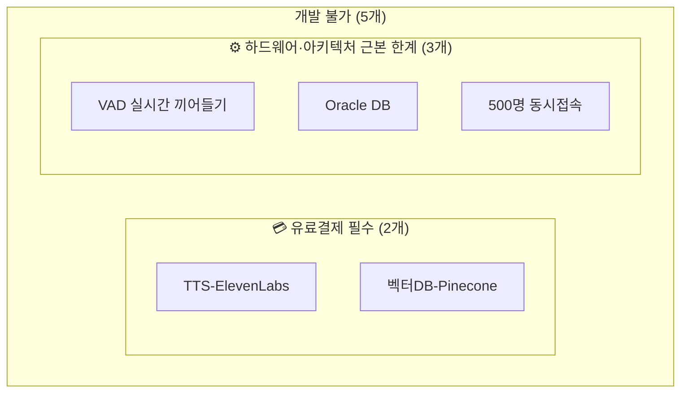

# 스펙 비교 아티팩트 재분류 — 완료 승격 및 개발불가 서브그룹 분리

- **작업일**: 2026-09-24 11:40 (실제 작업 순서 기준 배치 시각, 정본은 `docs/harness/decisions.md` DEC-067)
- **관련 결정 로그**: DEC-067
- **요청 내용**: "부분착수에서 완료할 수 있는 건 알려주고, 개발불가에서 유료서비스라서 개발불가라면 따로 분리해달라."

## 한 일

1. **화이트보드 AI비전을 "부분착수"→"완료"로 재분류** — 2026-09-23(DEC-061/062)에 이미 실제 서비스 경로 배선 + 인증 포함 실HTTP E2E 검증까지 끝났는데도 "부분착수"로 잘못 남아있던 일관성 오류를 발견해 바로잡음(같은 날 STT-Deepgram은 동일 근거로 "완료" 처리했었음). 코드 변경 없음, 문서 재분류만.
2. **"개발 불가" 5개 그룹을 서브그룹으로 시각 분리**.

## 남은 부분착수 6건 분석 결과(채팅 답변, 코드 변경 없음)

| 항목 | 완료 가능 여부 |
|---|---|
| WebRTC 시그널링 | 수주 단위 대규모 작업, 즉시 완료 불가 |
| DeepFace | 법무 판단 필요, 코드 작업만으로 완료 불가 |
| K8s 매니페스트 | 로컬 minikube/kind로 완료 가능성 있음 |
| GDPR 데이터 이동권 | 법무 판단 필요 |
| STT 실시간 스트리밍 | 스크롤게이트 우회 기법 실증되어 재검증 가능 |
| 코드 샌드박스 배선 | 기술 검증 끝났으나 배선 자체는 별도 사용자 승인 필요 |

이 중 K8s/STT스트리밍/코드샌드박스 배선 3건은 사용자 선택 대기로 남김(임의 진행하지 않음).

## 영향받은 산출물

spec-compare 아티팩트(화이트보드 완료 전환, 개발불가 서브그룹 분리 `.subgrouprow` CSS 신규).
