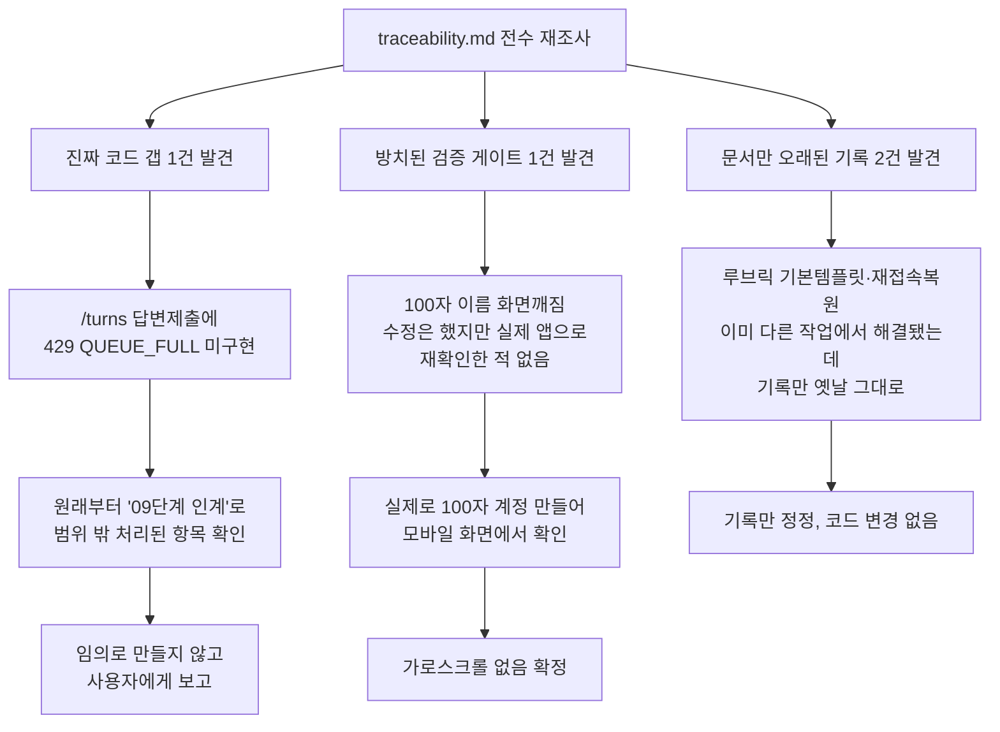

# 원 계획서 대조 재점검 — 전수 스윕으로 발견한 잔여 갭 처리

- **작업일**: 2026-09-28 21:30 (KST)
- **관련 결정 로그**: DEC-095
- **요청 내용**: 사용자가 "Git작업 이외에 원본에 맞추어 작업할 내용이 더이상
  없는건가요?"라고 질문 — 추측으로 답하지 않고 실제로 다시 전수 조사.

## 배경

그동안 "07단계 통합테스트 부채"와 "부분착수 미완료건"은 여러 번 재확인했지만,
`traceability.md` 전체를 "미구현/잔여부채/사용자결정대기" 키워드로 처음부터
끝까지 다시 훑어본 적은 없었다. 사용자의 질문을 계기로 처음으로 전수 조사를
했다.

## 한 일과 발견

### 1. 진짜 남아있던 코드 갭: 답변 제출 시 "대기열 꽉 참" 방어 없음

면접 중 지원자가 답변을 보낼 때, 만약 AI 처리 대기열이 꽉 차면(설계상 50개 한도)
"지금은 요청이 많아 기다려주세요"라고 안내하는 기능이 원래 설계에 있었는데,
이게 아직 없다. 대신 채용담당자가 쓰는 "재채점" 버튼에는 이미 이 방어가
붙어있다(전에 실측 확인한 바로 그 기능).

그런데 이건 원래부터 의도적으로 빠뜨린 게 아니라, "이건 다른 보호장치(속도
제한)랑 겹치는 부분이라 09단계에서 처리하기로" 코드 안에 이미 명시적으로
적혀있던 계획이었다. 그래서 이번에도 마음대로 만들지 않고, 발견한 사실만
정리해서 보고한다.

### 2. 오랫동안 방치된 검증: 100자 이름 화면 깨짐 재확인

2026-09-20에 "지원자 이름이 100자(최대 길이)일 때 홈 화면이 옆으로 밀린다"는
버그를 고쳤는데, 그 수정 이후로 **실제 화면으로 다시 확인한 적이 한 번도
없었다.** 당시 기록에도 "08단계 시작 전에 반드시 다시 확인할 것"이라고
명시적으로 적혀있었는데 방치돼 있었다.

이번에 직접 100자짜리 이름으로 계정을 만들어서 실제 휴대폰 화면 크기로 열어봤다
— 문제없이 잘 줄바꿈되고, 가로로 밀리지 않는다. 이 확인 절차 자체가 처음으로
완료됐다.

### 3. 기록만 낡았던 것 2건

- 루브릭 "기본 템플릿"이 없다고 적혀있었는데, 실제로는 이미 다른 작업(2026-09-23)
  에서 만들어져 있었다. 기록만 안 고쳐져 있었다.
- 코드 에디터·화이트보드를 재접속했을 때 복원이 안 된다고 적혀있었는데, 실제로는
  이미 다른 작업에서 다 만들어져서 잘 동작하는 걸 여러 번 확인했었다. 이것도
  기록만 안 고쳐져 있었다.

둘 다 코드는 이미 정상이고, 기록만 정정했다.

## 영향받은 산출물

`docs/harness/traceability.md`(REQ-002/013/014), `docs/harness/decisions.md`
(DEC-095). 코드 변경 없음.
