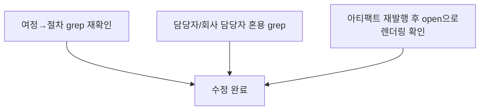

# 이력서제출 설명 아티팩트 — 25세 기준 누락분 보정 + "여정→절차" 용어 교체

- **작업 일시**: 2026-09-30 (KST)
- **관련 DEC**: DEC-103 (`docs/harness/decisions.md`)
- **선행 작업**: DEC-102(이력서제출여정 화면 문구 25세 눈높이 재작성)

## 1. 무엇을 요청받았는가

DEC-102 완료 보고 직후, 사용자가 모바일 스크린샷을 보내며 "이 파일 25세
기준으로 변경 안한건가요?"라고 지적했다. 이어서 "여정 이라는 문구 모두
절차 라는 문구로 변경해줘 / 전체적으로 문구도 20년 기획자 기준으로
변경해줘"라고 추가 지시했다.

## 2. 무엇을 했는가

**놓친 부분 인정**: 스크린샷 속 화면은 실제 앱 소스코드(`frontend-apply/`,
`frontend/app/recruiter/**`)가 아니라, 2026-09-29(DEC-100) 별도 요청으로
만든 **독립 설명용 아티팩트**(`https://claude.ai/artifact/9WauvNaQgxA57HLeNfH925`,
"초등학생도 이해할" 수준으로 제작된 이력서제출 흐름 다이어그램)였다.
DEC-102는 "화면"을 소스코드 파일 단위로만 해석해 이 아티팩트를 빠뜨렸다 —
사용자에게 원인을 그대로 설명하고 즉시 두 단계로 수정했다.

**1차 수정(어린이 말투 제거)**:
- 제목 "🎒 이력서 내고 면접 보러 가는 길" → "💼 이력서 제출부터 모의면접까지"
- 합격/불합격 갈림길 라벨 "정말 잘했어요!"/"아쉬워요"(교사가 채점하는 말투)
  → "합격"/"불합격"
- 불합격 노드의 우는 이모지(😢) → 중립적인 우편 이모지(📩)

**2차 수정(용어 교체 + 전문 기획자 기준 정밀화)**:
- "여정" 2건(`<title>`, 섹션 제목) 전부 "절차"로 교체
- 문서 곳곳에서 혼용되던 "담당자"/"회사 담당자"를 앱이 실제로 쓰는 역할명
  "채용담당자"로 통일
- "판단하기" → 앱의 실제 섹션 제목과 동일한 "합격/불합격 결정"
- "이메일 문구" → DEC-102에서 통일한 "안내" 용어에 맞춰 "안내 초안"
- "'발송 완료'로 표시해두기" → 앱의 실제 버튼 문구와 정확히 일치하는
  "'발송 완료로 표시' 누르기"
- 그 외 문장부호(과도한 느낌표 등) 정리, 화면 지도 섹션 제목/부제 간결화

## 3. 검증

- 로컬 파일 grep으로 "여정", "회사 담당자" 문자열이 더 이상 남아있지 않음을
  확인한 뒤 같은 URL로 재발행(v2 → v3).
- 앱 소스코드·API·DB는 이번 작업에서 전혀 건드리지 않음(순수 설명용
  아티팩트 문구만 수정) — 별도의 백엔드/프런트 헬스체크는 해당 없음
  (규칙 K-6은 로컬 서버 대상 부하/E2E 테스트 시 적용되는데, 이번 작업은
  Claude 아티팩트 플랫폼에 대한 정적 문서 재발행이라 대상 아님).

## 4. 교훈 (메모리에 별도 기록)

이번 건으로 두 가지를 `memory/feedback_copy-terminology-and-scope.md`에
기록했다:
1. 이 프로젝트에서는 "여정" 대신 "절차"를 선호한다 — 향후 신규 카피에도
   기본 적용.
2. "OO 화면 문구를 바꿔줘" 요청은 소스코드 파일뿐 아니라 그 기능을
   설명하는 모든 사용자 대상 산출물(별도 아티팩트 포함)을 포괄한다 —
   다음부터는 작업 시작 전에 관련 아티팩트가 있는지 먼저 점검한다.

## 5. 영향받는 파일

- `https://claude.ai/artifact/9WauvNaQgxA57HLeNfH925` (아티팩트, v2→v3, 코드 변경 아님)
- `docs/harness/decisions.md` (DEC-103 신규)
- `memory/feedback_copy-terminology-and-scope.md` (신규)
- `memory/project_resume-journey-copy-rewrite.md` (참고 링크 갱신)

git add/commit/push는 지시하신 대로 진행하지 않았습니다.
