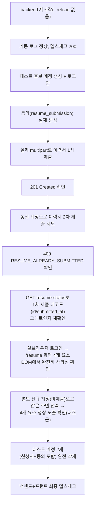

# 이력서 1회 제출 후 재제출 차단 (화면 + 백엔드 양쪽)

- **작업 일시**: 2026-09-30 (KST)
- **관련 DEC**: DEC-118 (`docs/harness/decisions.md`)

## 1. 무엇을 요청받았는가

사용자가 `/resume` 화면 스크린샷(빨간 테두리로 표시)과 함께 요청:

> "이력서를 제출한 이후에 추가적으로 이력서를 제출하지 못하도록 화면에서
> 기능을 막으려고 합니다. 이력서 제출을 1번이라도 했다면 첨부한 빨간색
> 테두리 부분 모두 보이지 않도록 처리해줘. 이력서가 제출한 이후에는 상태만
> 확인이 가능해야 합니다."

빨간 테두리 영역 = 샘플 양식 다운로드 버튼, 파일 선택 입력, 개인정보 동의
체크박스, 제출하기 버튼 4개 UI 요소.

**착수 전 확인(AskUserQuestion, 임의 진행 금지 원칙)**: 요청 문구가 "화면에서
기능을 막으려고"였는데, 화면(프런트엔드)만 막으면 개발자도구나 직접 API
호출로는 여전히 재제출이 가능하다는 점을 설명하고 백엔드도 함께 막을지
확인 — 사용자가 **"백엔드도 막기(권장)"**를 선택.

## 2. 무엇을 했는가

기존 정책(원설계 §4-1, REQ-040/041)은 "재제출 언제든 허용 — 기존 지원서를
덮어쓰고 상태를 pending으로 되돌림"이었다. 이를 "최초 1회 제출 후 완전
차단(상태 무관)"으로 정책 자체를 교체했다.

- **백엔드** (`backend/app/api/v1/resumes.py::submit_resume`):
  - 기존 지원서 존재 여부를 확인하는 코드를 파일 파싱/검증보다 **먼저**
    수행하도록 이동 — 있으면 즉시 `409 RESUME_ALREADY_SUBMITTED`를 반환하고
    끝낸다(불필요한 파일 업로드/디스크 쓰기를 막음).
  - 기존에 있던 "덮어쓰기 + pending으로 리셋" 분기를 완전히 제거.
  - 그 분기에서만 쓰이던 `_delete_resume_file` 헬퍼 함수도 이제 아무 데서도
    안 쓰여 함께 삭제(죽은 코드 방지).
- **프런트엔드** (`frontend-apply/app/resume/page.tsx`):
  - 스크린샷의 4개 요소(샘플 다운로드·파일 입력·동의 체크박스·제출 버튼)를
    `status === null`(지원서 기록이 아예 없음)일 때만 렌더링하도록 조건부
    처리.
  - 지원서 기록이 있으면(상태 무관) 그 자리에 "이력서는 한 번만 제출할 수
    있어요. 위 상태만 확인해주세요." 안내 문구로 대체.
  - 파일 상단 docstring을 새 정책에 맞게 갱신, "화면 차단은 UX일 뿐 실제
    방어는 백엔드에 있다"는 설계 의도를 주석으로 명시.

## 3. 검증 — 실제 백엔드 재시작 + 실제 HTTP 2회 제출 + 실브라우저 양쪽 케이스

| 검증 항목 | 방법 | 결과 |
|---|---|---|
| 백엔드 구문 오류 없음 | `python -c "ast.parse(...)"` | 통과 |
| 백엔드 재시작 후 정상 기동 | `preview_stop`→`preview_start`, 로그 확인 | `Application startup complete`, 에러 없음 |
| 헬스체크 | `GET /api/v1/health` | `200` |
| 1차 제출 성공 | 실제 multipart `POST /api/v1/resumes` (샘플 PDF 첨부) | `201 Created` |
| 2차 제출 차단 | 동일 계정으로 동일 요청 재실행 | `409`, `code: RESUME_ALREADY_SUBMITTED`, 한글 안내 메시지 정상 |
| 차단된 시도가 기존 데이터를 훼손하지 않음 | `GET /users/me/resume-status`로 `id`/`submitted_at` 재대조 | 1차 제출 값과 100% 동일(덮어쓰기 없음) |
| 프런트 — 이미 제출한 계정 | 실브라우저 로그인 → `/resume` → `get_page_text` + `javascript_tool`로 DOM 직접 조회 | 파일 입력·체크박스·다운로드 링크·제출 버튼 전부 `false`/`0개`(완전히 렌더링 안 됨), "이력서는 한 번만 제출할 수 있어요" 안내문만 노출 |
| 프런트 — 아직 제출 안 한 계정(대조군) | 신규 회원가입 후 동일 화면 접속 | 4개 요소 전부 정상 노출(회귀 없음 확인) |
| 테스트 데이터 정리(규칙 K) | 테스트 후보 2명(신청서·동의 레코드 포함) DB에서 완전 삭제 | 확인 완료 |
| 최종 헬스체크(규칙 K-6) | `GET /api/v1/health`, `GET /login`(3002), 실제 로그인(핵심 경로) | 전부 `200` |

## 4. 설계 근거 — 왜 백엔드도 막았는가

사용자가 처음엔 "화면에서 기능을 막으려고"라고만 표현했지만, 20년차 보안
관점에서 프런트엔드 전용 차단은 실제 방어가 아니라 UX 개선에 불과하다 —
로그인 토큰만 있으면 브라우저 개발자도구의 `fetch()`나 curl 같은 도구로
화면을 거치지 않고 그대로 API를 호출해 정책을 우회할 수 있다. 이 점을
설명하고 AskUserQuestion으로 확인한 뒤 사용자가 "백엔드도 막기(권장)"를
선택 — 화면은 사용자 경험(왜 제출이 안 되는지 설명), 백엔드는 실제 정책
집행(우회 불가능한 강제)이라는 역할 분리로 구현했다.

## 5. 뒷정리 (규칙 K) + 헬스체크 (규칙 K-6)

- 검증용 테스트 후보 2개 계정(`resubmit.test.20260930@local.dev`,
  `nosubmit.test.20260930@local.dev`) — 이력서 신청서·동의(consent) 레코드
  포함 전부 DB에서 완전 삭제.
- 백엔드(`GET /api/v1/health`)·지원자 앱(3002)·실제 로그인(핵심 경로)
  전부 `200` 재확인.

## 6. 영향받는 파일

- `backend/app/api/v1/resumes.py`
- `frontend-apply/app/resume/page.tsx`
- `docs/harness/decisions.md` (DEC-118 신규)

## 7. 참고 — 기존 정책과의 차이(비가역성 낮음, 필요 시 되돌리기 쉬움)

이 변경은 DB 스키마나 마이그레이션을 건드리지 않는 순수 애플리케이션
로직 변경이다. 예전 "재제출 허용" 정책으로 되돌리고 싶다면 이번에 제거한
두 분기(백엔드의 덮어쓰기 로직, 프런트의 조건부 숨김)만 되돌리면 된다 —
기존에 이미 제출된 지원서 데이터에는 어떤 영향도 없다.

git add/commit/push는 지시하신 대로 진행하지 않았습니다.
