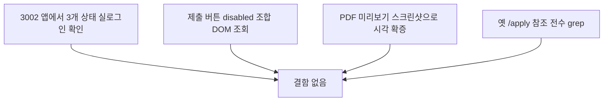

# 이력서 제출/상태 확인 — 20년차 기준 전수 재검토

- **작업 일시**: 2026-09-29 (KST)
- **관련 DEC**: DEC-101 (`docs/harness/decisions.md`)
- **관련 REQ**: REQ-042 (`docs/harness/traceability.md`)

## 1. 무엇을 요청받았는가

"이력서 제출/상태 확인, 전체적으로 진행하는데 문제가 없는지 20년 경력자
기준으로 검토만 해줘. 2번 일 시키지 않게 확실하게."

## 2. 무엇을 했는가 — 코드 리뷰가 아니라 실측 재검증

포트 분리(DEC-100) 이후 새 앱(3002)에서 아직 직접 재현해보지 않았던
지점들을 실제로 다시 눌러보고 눈으로 확인했다:

1. **pending/accepted/rejected 3개 상태**를 실제로 만든 뒤(합격은 면접
   일정 문구까지 포함) 3002 앱에 각각 실로그인해 화면 문구가 정확한지 확인
2. "제출하기" 버튼의 **비활성/활성 상태 조합**(파일 없음+동의 없음 →
   비활성, 동의만 체크 → 여전히 비활성)을 DOM에서 직접 조회
3. 관리자 PDF 미리보기가 "DOM에 iframe이 있다"까지만 확인했던 이전 검증의
   한계를 인지하고, **실제 스크린샷**으로 크롬 내장 PDF 뷰어가 화면에 정말
   렌더링되는 것을 확증
4. 코드 전체를 grep해 옛 `/apply/register`·`/apply/login`·`/apply/resume`·
   `ApplyHomeLink` 참조가 어디에도 남아있지 않은지 확인(포트 이전 불완전
   여부 점검)

## 3. 결과

**결함 0건.** 전부 정상 동작을 실측으로 확인했다.

**유일하게 남은 검증 공백**: 실제 브라우저 `<input type=file>` 클릭 → 로컬
파일 선택 자체는 이 세션의 브라우저 자동화 도구가 여전히 프로그래밍적으로
지원하지 않는다(기존에 이미 문서화된 도구 한계). 대신 그 경로는 실HTTP
multipart 업로드로 바이트 단위까지 이미 검증되어 있다.

## 4. 뒷정리 (규칙 K)

- 재검증용 테스트 계정 4개 + 지원서 3건 + PDF 파일 3건 삭제,
  `backend/var/resumes/` 재확인 결과 비어있음
- 백엔드 재기동 없이 `GET /api/v1/health` → `200 {"status":"ok"}` 확인(규칙 K-6)

## 5. 영향받는 파일

- `docs/harness/decisions.md`(DEC-101 신규, 코드 변경 없음)
- `docs/harness/traceability.md`(REQ-042 갱신)

git add/commit/push는 지시하신 대로 진행하지 않았습니다.
