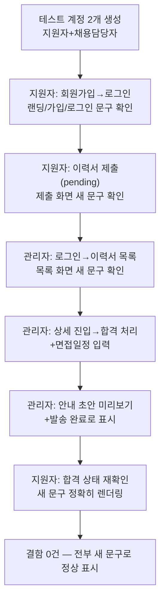

# 이력서제출여정 문구 — 25세 눈높이로 재작성 (지원자+관리자 화면)

- **작업 일시**: 2026-09-30 (KST, 전날 밤부터 이어진 작업)
- **관련 DEC**: DEC-102 (`docs/harness/decisions.md`)

## 1. 무엇을 요청받았는가

"이력서제출여정 지원자, 관리자 화면 모두 적용해줘 / 20년차 앞으로도 절대
잊지말고 기억하세요" — 이력서 제출/심사 흐름에서 사용자에게 보이는 모든 한글
문구를 25세 남녀가 바로 이해할 수 있는 말투로 바꿔달라는 요청. 구조(라우트,
폼 필드, 로직, API 계약)는 그대로 두고 문구만 교체하는 조건.

원래는 "자동 이메일 발송 + Notion 자동 기록" 기능(현재 Gmail 앱 비밀번호·
Notion 토큰 대기로 블로킹 상태)을 먼저 끝낸 뒤 착수할 예정이었으나, 사용자가
"이 작업은 잠시대기해줘 ... 이부분 먼저 진행해줘"라고 순서를 재조정해 이번
세션에서 먼저 진행했다.

## 2. 무엇을 했는가

**대상 범위**: 지원자용 앱(`frontend-apply/`, 3002번 포트)과 관리자(채용담당자)
이력서 검토 화면(`frontend/app/recruiter/resumes/**`, `frontend/app/recruiter/page.tsx`,
3001번 포트) 양쪽.

- 격식체("~습니다") 위주였던 문장을 "~해요/~어요"체로, 이중부정·중복 표현을
  단문으로 정리(예: "합격 여부를 확인하고 합격 여부를 확인" 식 중복 제거,
  "서류 심사 결과를 등록하신 이메일로 안내드립니다" → "서류 심사 결과를
  이메일로 알려드려요" 등).
- 에러/안내 메시지 전반을 부드럽게 교체("올바른 이메일 형식이 아닙니다." →
  "이메일 형식을 다시 확인해주세요." 등).

**문구 정리 도중 발견해 함께 고친 실제 문제 2건**(단순 말투 교체를 넘어선 것):

1. 권한 오류 화면에 내부 역할 코드(영문)가 그대로 노출되고 있었음 —
   "지원자(candidate) 계정만 가능합니다", "채용담당자(recruiter) 계정만
   접근할 수 있습니다" 등. 일반 사용자는 `candidate`/`recruiter`가 무슨
   뜻인지 알 수 없으므로 한글만 남기도록 수정.
2. 관리자 상세 화면의 합격/불합격 안내 문구가 "관리자 본인의 Claude+MCP
   메일 도구로 발송해주세요"라고 되어 있어, 내부 구현 도구명이 채용담당자
   화면에 그대로 노출되고 있었음 — "이메일로 직접 보내주세요"로 교체.

**용어 통일**: "통보"(공문서투 격식 단어)를 "안내"로 일관 교체(섹션 제목,
목록 테이블 헤더, 완료 상태 라벨 등).

## 3. 검증 결과 — 실제 화면 클릭으로 확인 (코드 리뷰만이 아님)

| 확인 화면 | 확인한 새 문구 | 결과 |
|---|---|---|
| 지원자 랜딩(`/`) | "회원가입하고 이력서를 제출하면..." | PASS |
| 지원자 가입(`/register`) | "이 계정은 나중에 모의면접 사이트에서도..." | PASS |
| 지원자 이력서(`/resume`, pending) | "서류를 심사하고 있어요..." | PASS |
| 지원자 이력서(`/resume`, accepted) | "서류 전형에 합격했어요!..." + "면접 일정:" | PASS |
| 관리자 목록(`/recruiter/resumes`) | 부제 안내문 + "안내" 컬럼 | PASS |
| 관리자 상세(`/recruiter/resumes/[id]`) | "합격/불합격 결정" 섹션명, "합격/불합격 안내" 섹션명, "Claude+MCP" 문구 제거 확인 | PASS |
| 관리자 상세 — 안내 완료 표시 | "안내 완료: 2026. 9. 30. 오전 12:02:49" | PASS |
| 관리자 대시보드(`/recruiter`) | "우리 조직의 모든 지원자 면접 내역을..." | PASS |

## 4. 뒷정리 (규칙 K) + 헬스체크 (규칙 K-6)

- 테스트용 지원자/채용담당자 계정 2개, 이력서 신청 레코드 1건, 동의 레코드
  1건 DB 직접 삭제 후 `backend/var/resumes/`에 남은 고아 PDF 파일도 확인해
  함께 삭제(빈 디렉터리 재확인 완료).
- 임시 스크래치 파일(`/tmp/*_copy.json`, `/tmp/*_token.txt`) 삭제.
- 부하성 테스트는 아니었지만(브라우저 클릭 수회 + API 직접 호출 소량) 규칙
  K-6에 따라 완료 보고 전 확인: `GET /api/v1/health` → `200 {"status":"ok"}`,
  `GET /recruiter`(3001) → `200`, `GET /`(3002) → `200`. 전부 정상.

## 5. 영향받는 파일

- `frontend-apply/app/layout.tsx`
- `frontend-apply/app/page.tsx`
- `frontend-apply/app/register/page.tsx`
- `frontend-apply/app/login/page.tsx`
- `frontend-apply/app/resume/page.tsx`
- `frontend/app/recruiter/page.tsx`
- `frontend/app/recruiter/resumes/page.tsx`
- `frontend/app/recruiter/resumes/[id]/page.tsx`
- `docs/harness/decisions.md`(DEC-102 신규)

## 6. 이번 범위에서 의도적으로 제외한 것

- 백엔드가 생성하는 합격/불합격 안내 이메일 "초안 본문" 자체(서버 템플릿
  텍스트, 관리자가 화면에서 "미리보기"로 불러오는 내용)는 문구를 바꾸지
  않았다. 사용자 요청이 "지원자, 관리자 **화면**"이라고 명시했고, 이건
  화면(UI) 텍스트가 아니라 백엔드가 만들어내는 이메일 콘텐츠라 별도
  확인 없이 임의로 포함시키지 않았다. 필요하면 별도로 요청해달라고
  다음 응답에서 안내한다.
- `frontend/app/recruiter/[id]/page.tsx`(면접 리포트 상세), `frontend/app/recruiter/rubric-templates/page.tsx`는
  "이력서제출여정"이 아니라 모의면접 리포트/루브릭 영역이라 범위에서 제외.

git add/commit/push는 지시하신 대로 진행하지 않았습니다.
