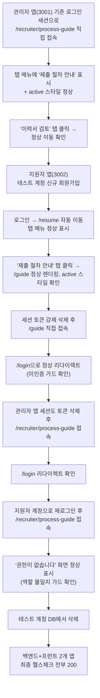

# 이력서제출절차 안내 화면을 실제 앱 안에 추가 (지원자·관리자 양쪽, 탭 메뉴)

- **작업 일시**: 2026-09-30 (KST)
- **관련 DEC**: DEC-117 (`docs/harness/decisions.md`)

## 1. 무엇을 요청받았는가

직전 작업(합격/불합격 안내 메일 자동발송) 완료 보고 때 남겨뒀던 미답변 질문 —
"이력서제출절차/전체 진행절차" 화면을 외부 참고용 Claude Artifact로만 둘지,
실제 앱 안의 화면으로 만들지 — 에 대해 사용자가 이번에 명확히 답했다:

> "이력서제출절차 화면은 실제 앱 안에 만들어주세요. 이력서 제출자와 로그인
> 이후에 탭 메뉴로 확인할 수 있도록, 관리자화면도 로그인 이후에 탭 메뉴로
> 확인할 수 있도록"

즉 (1) 실제 앱 화면으로 구현, (2) 지원자 앱·관리자 앱 양쪽 모두, (3) 둘 다
"로그인 이후" + "탭 메뉴"로 접근 가능해야 한다는 3가지 요구사항.

**판단이 필요했던 부분(질문 없이 에이전트가 결정)**: 기존 외부 아티팩트
(https://claude.ai/artifact/9WauvNaQgxA57HLeNfH925, DEC-100)는 mermaid
다이어그램으로 절차를 표현했다. 이 두 프로덕션 앱(`frontend`, `frontend-apply`)
에는 차트 라이브러리가 전혀 없고, 이 화면 하나를 위해 mermaid.js를 새로
추가하는 것은 과한 의존성 추가라고 판단 — 이미 두 앱이 채택 중인 번호 단계
카드(step) 스타일(다른 화면에는 없었지만, 색상·둥근 모서리·타이포그래피는
기존 `.field`/`.submit-button`/`.room-tab` 디자인 토큰을 그대로 재사용)로
표현하기로 결정했다. 새 의존성을 추가하지 않는 저위험 기술 선택이라 별도로
질문하지 않고 진행했다(대사용자 확인이 필요한 수준의 결정은 아니라고 판단).

## 2. 무엇을 했는가

### 지원자 앱 (frontend-apply, 3002번 포트)
- `components/ApplyTabs.tsx` 신규 — `frontend`의 `RecruiterListTabs.tsx`와
  완전히 동일한 패턴(`usePathname` 기반 active 판정, 동일 CSS 클래스명)으로
  작성. 탭 2개: "이력서 제출"(`/resume`, 기존) · "제출 절차 안내"(`/guide`, 신규).
- `app/guide/page.tsx` 신규 — 로그인 가드(미인증 시 `/login` 리다이렉트,
  기존 `/resume` 페이지와 동일한 패턴) + 지원자가 거치는 6단계를 번호 카드로
  표시. 원본 아티팩트의 "합격/불합격 안내 메일은 관리자가 직접 발송" 문구는
  DEC-116(자동발송 전환) 이후 사실과 달라져 **"판단 저장 즉시 시스템이 자동
  발송, 실패 시에만 관리자가 직접 발송"**으로 고쳐 썼다.
- `app/resume/page.tsx` — `<ApplyTabs />`를 `<HomeLink />` 아래에 추가.
- `app/globals.css` — 탭 메뉴 CSS(`.interview-room__tabs`/`.room-tab`/
  `.room-tab--active`, `frontend`와 동일 클래스명·유사 토큰) + 단계 카드 CSS
  (`.guide-step`/`.guide-step__num`/`.guide-note`) 신규 추가.

### 관리자 앱 (frontend, 3001번 포트)
- `components/RecruiterListTabs.tsx` — 기존 탭 목록(지원자 리포트·이력서
  검토·채용담당자 추가) 사이에 "제출 절차 안내"(`/recruiter/process-guide`)
  탭 추가.
- `app/recruiter/process-guide/page.tsx` 신규 — 로그인 가드(미인증 리다이렉트
  + `recruiter` 역할이 아니면 권한없음 화면, 기존 `/recruiter` 페이지와 동일
  패턴) + 채용담당자가 관여하는 5단계(회원가입→이력서 제출→서류
  심사→**안내 메일 자동 발송**→모의면접 진행)를 번호 카드로 표시.
- `app/globals.css` — 단계 카드 CSS(`.guide-step`/`.guide-step__num`/
  `.guide-note`) 신규 추가(지원자 앱과 동일 클래스명, 토큰만 각 앱 것 사용).

## 3. 검증 — 실브라우저로 양쪽 앱 전부 실제 클릭·로그인 테스트

| 검증 항목 | 방법 | 결과 |
|---|---|---|
| 관리자 앱 탭 메뉴에 신규 탭 표시 | 실브라우저 `get_page_text` | "제출 절차 안내" 탭 정상 노출, 순서(지원자 리포트→이력서 검토→제출 절차 안내→채용담당자 추가)도 의도대로 |
| 관리자 앱 신규 화면 콘텐츠 | 실브라우저 렌더링 확인 | 5단계 카드 전부 정확히 표시, "안내 메일 자동 발송" 단계가 실제 동작(DEC-116)과 일치 |
| 관리자 앱 active 탭 스타일 | `javascript_tool`로 `.room-tab--active` 클래스 직접 조회 | "제출 절차 안내"에만 `active: true` |
| 관리자 앱 탭 간 이동 | "이력서 검토" 탭 실클릭 | `/recruiter/resumes`로 정상 이동, 기존 화면 그대로 정상 렌더링 |
| 지원자 앱 신규 회원가입→로그인 | 실브라우저로 전 구간 직접 입력·클릭 | 정상 가입, `/resume`으로 정상 리다이렉트 |
| 지원자 앱 탭 메뉴 신설(기존엔 없었음) | 실브라우저 `get_page_text` | "이력서 제출"·"제출 절차 안내" 2개 탭 정상 노출 |
| 지원자 앱 신규 화면 콘텐츠 | 실브라우저 렌더링 확인 | 6단계 카드 전부 정확히 표시, "합격·불합격 안내 메일" 문구가 자동발송 기준으로 정확히 갱신됨 |
| 지원자 앱 active 탭 스타일 | `javascript_tool`로 `.room-tab--active` 클래스 직접 조회 | "제출 절차 안내"에만 `active: true` |
| 지원자 앱 미인증 가드 | `sessionStorage`/`localStorage` 강제 삭제 후 `/guide` 직접 접속 | `/login`으로 정상 리다이렉트 |
| 관리자 앱 미인증 가드 | 동일 방법으로 `/recruiter/process-guide` 직접 접속 | `/login`으로 정상 리다이렉트 |
| 관리자 앱 역할 불일치 가드 | 지원자 계정으로 로그인한 채 `/recruiter/process-guide` 접속 | "권한이 없습니다 — 이 화면은 채용담당자 계정으로만 볼 수 있어요" 정상 표시 |
| 콘솔/네트워크 에러 없음 | `preview_logs` 에러 필터 | 브라우저 확장 프로그램발 기존 hydration 경고(이 세션 전역에서 반복 확인된 것, DEC-064 계열)만 있고 신규 에러 없음 |
| 테스트 데이터 정리(규칙 K) | 테스트 후보 계정 DB 삭제 | 확인 완료 |
| 최종 헬스체크(규칙 K-6) | `GET /api/v1/health`, `GET /login`(3001), `GET /login`(3002) | 전부 `200` |

## 4. 설계 근거 — 왜 mermaid를 넣지 않았는가

원본 외부 아티팩트는 Claude Artifact 전용 mermaid 렌더링 런타임
(`/_runtime/mermaid-11.16.1.min.js`)을 자동으로 제공받는 환경이라 다이어그램을
그대로 썼지만, 이 두 프로덕션 Next.js 앱은 그런 런타임이 없다. 화면 하나를
위해 mermaid.js 같은 차트 라이브러리를 새로 추가하면 번들 크기·유지보수
표면이 늘어나는데, 이미 이 두 앱이 표·카드·배지로 정보를 전달해온 기존
패턴(예: 이력서 검토 목록의 상태 배지, 면접 세션 상태 표시)과도 어긋난다.
번호가 매겨진 단계 카드는 화살표가 있는 다이어그램과 동일한 정보(순서·분기)를
전달하면서 추가 의존성이 없어, 이 프로젝트의 기존 기술 스택 원칙(속도
우선·불필요한 복잡도 회피, DEC-003)에 더 맞는 선택이라고 판단했다.

## 5. 뒷정리 (규칙 K) + 헬스체크 (규칙 K-6)

- 검증용으로 만든 지원자 테스트 계정(`guide.test.20260930@local.dev`) 1개를
  DB에서 완전 삭제.
- 백엔드(`GET /api/v1/health`)·관리자 앱(3001)·지원자 앱(3002) 3곳 모두
  `200` 재확인.

## 6. 영향받는 파일

- `frontend-apply/components/ApplyTabs.tsx` (신규)
- `frontend-apply/app/guide/page.tsx` (신규)
- `frontend-apply/app/resume/page.tsx`
- `frontend-apply/app/globals.css`
- `frontend/components/RecruiterListTabs.tsx`
- `frontend/app/recruiter/process-guide/page.tsx` (신규)
- `frontend/app/globals.css`
- `docs/harness/decisions.md` (DEC-117 신규)

git add/commit/push는 지시하신 대로 진행하지 않았습니다.
