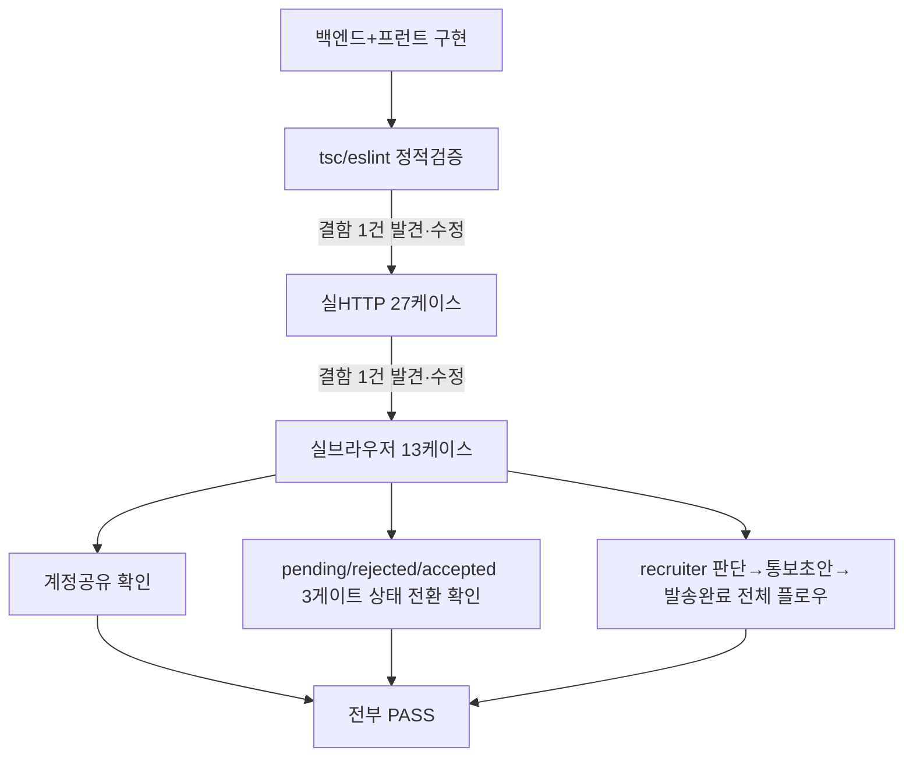

# 이력서 제출 → 서류 합격/불합격 → 모의면접 진행 신규 기능(Feature J)

- **작업 일시**: 2026-09-29 (KST)
- **관련 DEC**: DEC-098 (`docs/harness/decisions.md`)
- **관련 REQ**: REQ-040~044 (`docs/harness/traceability.md`, 신규 "Feature J" 섹션)
- **관련 테스트 결과서**: `docs/harness/feature-j-resume-application-20260929-test.md`

## 1. 무엇을 요청받았는가

사용자가 이전 턴에서 받은 `이력서제출_합격통보_신규기능_요청프롬프트.md`를
첨부하며 "첨부한 프롬프트 기준으로 개발 진행해줘"라고 지시했다. 그 프롬프트는
아래 4가지 설계 결정을 이미 사용자에게 확인받아 확정해둔 상태였다:

1. 같은 저장소(백엔드/프런트) 안에 새 경로로 확장(완전 별도 프로젝트 아님)
2. 이력서 제출자 계정과 모의면접 candidate 계정 공유(같은 이메일/비밀번호)
3. 합격/불합격 통보는 반자동 — 백엔드는 이메일을 발송하지 않고, 관리자가
   화면이 준비한 초안을 본인의 Claude+MCP 메일 도구로 직접 발송
4. 면접 일정은 강제력 없는 안내용 정보일 뿐

착수 직전, 프롬프트가 유일하게 열어뒀던 질문(이 기능 도입 이전 기존 계정의
하위호환 여부)을 `AskUserQuestion`으로 재확인 — "이력서 기록이 없으면
게이트 없이 기존처럼 자유롭게 진행"으로 확정했다(프롬프트 기본값 그대로).

## 2. 무엇을 했는가

### 2-1. 백엔드
- `resume_applications` 테이블 신설(Alembic `4381fbfa47d2`) — `candidate_id`
  UNIQUE, 재제출 시 기존 행을 덮어쓰고 상태를 `pending`으로 리셋
- `ConsentType`에 `resume_submission` 추가(`ALTER TYPE ... ADD VALUE`,
  기존 unit-14/15가 확립한 "새 개인정보 수집은 신규 ConsentType 사전동의
  필수" 패턴 그대로 적용)
- `POST /resumes`(PDF 제출, 화이트리스트+10MB 제한), `GET /users/me/resume-status`
  (본인 상태, 기록 없으면 `null`)
- `recruiter_resumes.py` 신규 — 목록/상세/파일다운로드/판단(합격·불합격)/
  통보초안/통보완료표시, 기존 `_require_recruiter`(단일조직 전체열람) 정책
  그대로 재사용

### 2-2. 프런트엔드
- `/apply/{register,login,resume}` — 기존 회원가입/로그인 엔드포인트를 그대로
  재사용(role은 candidate 고정), "현재 프로젝트와 동일한 형태" 요구에 맞춰
  기존 화면 스타일 그대로 재사용
- `/recruiter/resumes`(목록), `/recruiter/resumes/{id}`(상세+판단+통보초안
  미리보기+발송완료 체크), `/recruiter` 대시보드에 신규 메뉴 링크 추가
- `CandidateHome`(모의면접 홈)에 게이트 로직 — 지원서 상태가 accepted가
  아니면 "새 면접 시작" 대신 안내 배너, **지원서 기록 자체가 없으면 게이트
  하지 않음**(하위호환)
- `/mypage` 동의 이력에 신규 동의 타입 라벨 additive 반영

## 3. 검증 결과

| 구분 | 케이스 수 | 결과 |
|---|---|---|
| 백엔드 실HTTP | 27 | 전부 PASS |
| 프런트 실브라우저 | 13 | 전부 PASS |
| 발견·수정한 결함 | 2건 | 전부 즉시 수정 후 재검증 PASS |

**발견·수정한 결함**:
- 업로드 유효성 검사의 `isinstance` 오검증으로 정상 PDF도 항상 422 반환 →
  기존 음성 업로드 패턴(`hasattr(file, "read")`)으로 정정
- `mypage.tsx`의 동의 라벨 맵에 신규 타입 누락 → `tsc --noEmit`이 컴파일
  단계에서 검출, 라벨 추가로 해소

## 4. 뒷정리 (규칙 K)

- 테스트로 생성한 DB 행(계정 9개 + 지원서 3건 + 동의 다수) 전부 삭제
- 테스트로 생성한 PDF 파일(`backend/var/resumes/*.pdf`) 2건 삭제, 디렉터리
  비어있음 확인
- 정리 후 `git status`로 소스 변경분만 남았음을 확인(테스트 잔여물 0건)
- 백엔드 재기동 후 `GET /api/v1/health` → `200 {"status":"ok"}` 확인(규칙 K-6)

## 5. 영향받는 파일

- `backend/app/models/resume_application.py`(신규)
- `backend/app/models/consent.py`(enum 값 추가)
- `backend/app/schemas/resume.py`(신규)
- `backend/app/api/v1/resumes.py`(신규)
- `backend/app/api/v1/recruiter_resumes.py`(신규)
- `backend/app/main.py`(라우터 등록)
- `backend/app/services/celery_app.py`, `backend/alembic/env.py`(모델
  메타데이터 등록)
- `backend/alembic/versions/4381fbfa47d2_v17_resume_applications.py`(신규)
- `frontend/app/apply/**`(신규), `frontend/app/recruiter/resumes/**`(신규)
- `frontend/app/recruiter/page.tsx`, `frontend/app/mypage/page.tsx`,
  `frontend/components/CandidateHome.tsx`, `frontend/components/ApplyHomeLink.tsx`(신규)
- `frontend/lib/api.ts`(갱신)
- `docs/harness/decisions.md`(DEC-098 신규), `docs/harness/traceability.md`
  (REQ-040~044 신규), `docs/harness/feature-j-resume-application-20260929-test.md`
  (신규)

git add/commit/push는 지시하신 대로 진행하지 않았습니다.
