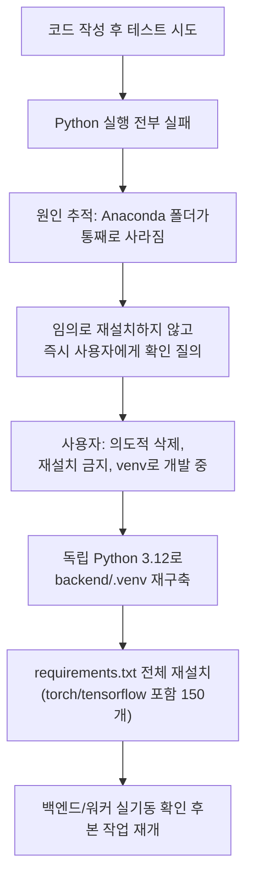

# 자동 파기 배치(unit-21) + 루브릭 weight 합계 검증(REQ-014 잔여 부채)

- **작업일**: 2026-09-28 18:10 (KST)
- **관련 결정 로그**: DEC-092(환경 사고 복구), DEC-093(실제 작업)
- **요청 내용**: "07단계 통합테스트 부채" 전체 완료 보고 후, 사용자가 정리해준
  "남은 작업" 목록 중 A번("코드로 실제 해결 가능한 미구현 항목") 진행 지시.
  추가로 "부분착수는 불가능한 항목인지 20년차 기준으로 검토"와 "매 작업 완료 시
  아티팩트 갱신"을 명시적으로 요청받음.

## 배경

2026-09-20에 unit-21로 배정된 뒤 한 번도 구현되지 않았던 자동 삭제/파기 배치
2개와, 루브릭 템플릿의 가중치 합계 검증 누락을 정산했다.

## 도중에 발생한 사고와 대응

코드를 다 쓰고 테스트하려는 순간 이 컴퓨터의 Python 실행 환경이 완전히
멈춰있는 걸 발견했다. 알고 보니 이 프로젝트가 의존하던 Anaconda가 통째로
사라져 있었다 — 확인해보니 사용자가 다른 방식(버전별 독립 venv)으로 개발
방식을 바꾸면서 의도적으로 지운 것이었다. 마음대로 Anaconda를 재설치하거나
다른 임의 조치를 하지 않고, 바로 사용자에게 "의도적이었는지" 확인부터
받았다. 확인 후 Anaconda 없이 독립 Python으로 개발 환경을 다시 만들고,
무거운 패키지(torch, tensorflow 등 150개)를 전부 재설치해 정상 작동을
재확인한 뒤에야 원래 하려던 작업을 이어갔다.

## 한 일

1. **`delete_requested_data`**(REQ-030) — 사용자가 삭제 요청한 생체정보를
   실제로 처리하는 배치. 매시간 자동 실행되도록 등록. 계정 전체 삭제
   (`full_account`) 처리도 함께 구현했는데, 이건 현재 이 기능을 실제로
   요청할 수 있는 화면/API가 아직 없어서 당장 쓰이진 않지만, 나중을 위해
   미리 만들어뒀다는 점을 문서에 명시했다.
2. **`purge_expired_data`**(REQ-033) — 화면에 "180일 지나면 자동 삭제됩니다"
   라고 써있던 약속을 실제로 지키는 배치. 매일 한 번 실행되도록 등록.
3. **루브릭 weight 합계 검증**(REQ-014) — 채용담당자가 평가 기준 가중치를
   만들 때 합이 100이 아니면 저장을 막도록 했다.

각각 실제 DB/HTTP로 검증했고(총 22개 케이스 전부 통과), 테스트 데이터는
전부 삭제 확인까지 마쳤다.

## 정직하게 밝히는 한계(20년차 기준 재검토 결과)

- 이 두 배치가 "정말로 매시간/매일 저절로 실행되는지"까지는 확인하지
  못했다 — 그러려면 실제로 몇 시간~하루를 기다려야 하는데, 이번 세션에서는
  그럴 수 없었다. 코드와 스케줄 설정은 맞게 돼 있고, 함수 자체를 직접
  불러서 실행해보니 정확히 의도대로 동작하는 것까지는 확인했다.
- `full_account`(계정 전체 삭제) 기능은 이걸 요청할 수 있는 화면이 아직
  없어서, 실제 서비스에서는 지금 당장 쓰일 일이 없는 코드다.
- unit-20(면접장 화면에 코드 에디터/화이트보드/웹캠을 배선한 작업)의 정식
  06단계 문서도 이번에 작성했는데, 처음부터 다시 전부 테스트한 게 아니라
  기존에 다른 이름으로 흩어져 있던 검증 결과들을 모아 정리한 것이라 **"완료"
  가 아니라 "부분 완료"로 표시했다** — 태블릿/모바일 화면, 실제 AI가 만드는
  자동 화면전환, 그리고 아직 답이 안 나온 설계 질문 4개는 여전히 미해결이다.

## 영향받은 산출물

`backend/app/worker/deletion_tasks.py`(신규), `backend/app/services/
celery_app.py`, `backend/app/api/v1/recruiter.py`, `docs/harness/
deletion-batch-weight-validation-20260928-test.md`(신규), `docs/harness/
units/unit-20-test.md`(신규), `docs/harness/traceability.md`(REQ-008/014/
015/017/030/033), `docs/harness/decisions.md`(DEC-092/093).
