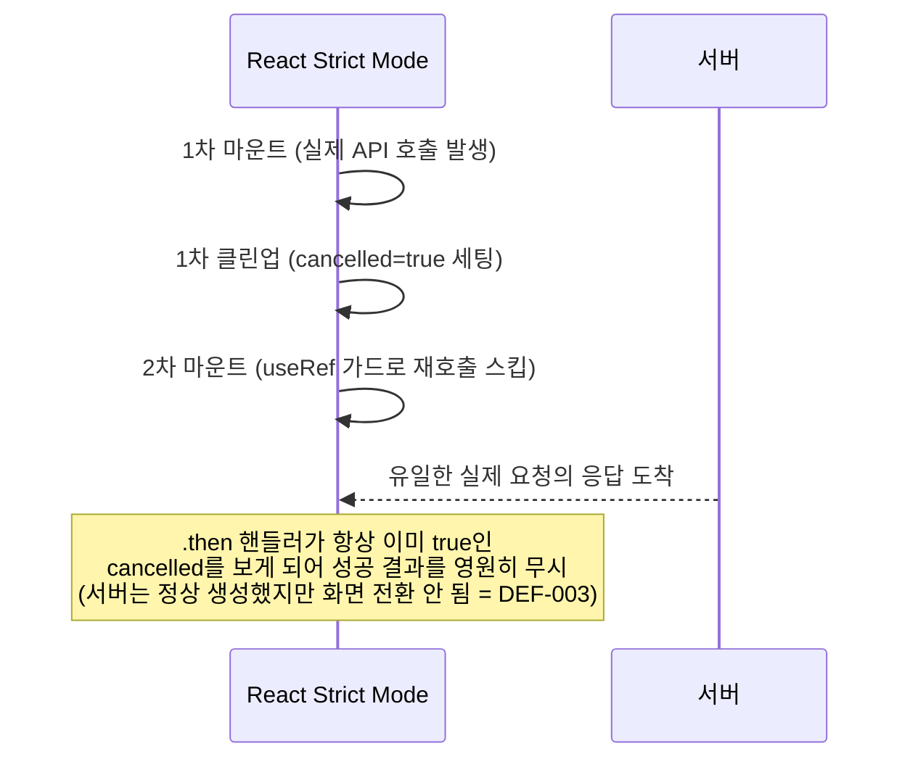

# DEF-002 수정의 자체 회귀(DEF-003) 발견·수정

- **작업일**: 2026-09-24 09:47 (실제 작업 순서 기준 배치 시각, 정본은 `docs/harness/decisions.md` DEC-065)
- **관련 결정 로그**: DEC-065
- **요청 내용**: 사용자가 직전 DEF-002 수정을 직접 재테스트했더니 "새 면접 세션을 만드는 중입니다..."에서 화면이 무한정 멈추고 hydration 에러 배지가 뜬다고 재신고. "테스트를 제대로 한 게 맞느냐"고 강하게 항의.

## 인정 및 재검증

정당한 지적이었음을 인정. 직전 재검증(DEC-064)은 "네트워크 요청이 1회만 나갔는가"만 확인했고, "그 요청의 성공 결과로 실제 화면이 다음 단계로 넘어가는가"까지는 확인하지 않았다.

## 원인 분석

- hydration 경고("1 Issue")는 **별개 원인**으로 확인 — 브라우저 확장 프로그램이 React 로드 전 DOM을 건드린 전형적 패턴(Next.js 공식 경고문과 일치). 완전히 새 탭+새 계정 재현 시 화면 멈춤은 동일하게 발생했으나 hydration 경고는 없어, 두 현상이 무관함을 확인.

## 조치 및 재검증

`cancelled` 클린업 로직을 완전히 제거(ref가 이미 "실제 호출 1회"를 보장하므로 불필요).

| TC | 확인 항목 | 결과 |
|---|---|---|
| TC-006 | 사전고지 화면 전문이 실제로 렌더링되는지(페이지 텍스트 직접 확인) | PASS |
| TC-007 | `POST /interviews` 정확히 1회 | PASS |
| TC-008 | 지원자 홈 목록 정확히 1건만 증가 | PASS |
| TC-009 | 콘솔 에러 0건 | PASS |

이번엔 완전히 새 브라우저 탭 + 완전히 새 계정으로 재검증했다(직전 재검증 부족 지적을 반영).

## 영향받은 산출물

`frontend/app/interviews/new/page.tsx`(DEF-003 수정 — `cancelled` 클린업 제거), `docs/harness/units/unit-15-test.md` §12(§11의 PASS 판정을 FAIL로 정정, append-only 원칙).
