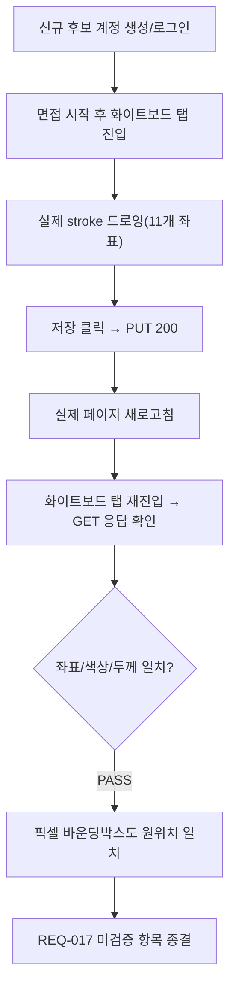

# Git 제외 잔여 항목 20년차 재검토

- **작업 일시**: 2026-09-28 (KST)
- **관련 DEC**: DEC-097 (`docs/harness/decisions.md`)
- **관련 REQ**: REQ-014, REQ-017 (`docs/harness/traceability.md`)

## 1. 무엇을 요청받았는가

QUEUE_FULL(429) 구현(DEC-096) 완료 보고 직후, 사용자가 "Git 이외에 더이상
남은건 없죠? 20년차 기준으로 검토해줘"라고 재차 확인을 요청했다. 이전 세션의
전수 스윕(DEC-095)은 이미 한 차례 있었지만, 그 이후(DEC-096) 편집이 놓친 게
없는지 `traceability.md` 전체를 다시 키워드("미구현", "미검증", "여전히",
"재확인 필요")로 훑어 재검토했다.

## 2. 무엇을 했는가

### 2-1. 문서 자체 모순 1건 발견·정정
REQ-014(루브릭 템플릿, unit-13) 행에서, 같은 날 작성된 두 개의 DEC 추가분이
서로 모순되는 것을 발견했다:
- DEC-089(먼저 작성): "시스템 기본 템플릿 시드는 unit-37이 이미 시딩 완료했음을
  재확인 — 이 부분은 이미 해소된 상태였다"
- DEC-093(나중에 작성): "시스템 기본 템플릿 시드 데이터 부재는 여전히 미해소"

DEC-093 작업 당시 DEC-089의 정정을 반영하지 않고 옛 표현을 그대로 재사용한
실수였다. 실제 DB를 직접 재조회해 `recruiter_id IS NULL` 시스템 기본 템플릿이
지금도 1건(가중치 합 100) 존재함을 재확인한 뒤, 모순 문구를 삭제·정정했다.

### 2-2. 실제로 검증 가능했던 항목 1건 완료 — 화이트보드 새로고침 복원
REQ-017(화이트보드, unit-20) 행이 유일하게 미검증으로 남겨뒀던 항목: "새로고침
후 픽셀 복원 재확인". 이전까지는 07단계가 그리기·저장·권한거부까지는 검증했지만,
실제 페이지 새로고침 이후 복원까지는 확인한 적이 없었다.

프런트(`localhost:3000`)를 새로 기동하고, 신규 후보 계정으로 실제
회원가입→로그인→동의→면접시작→화이트보드 탭 진입까지 실브라우저로 진행한 뒤:
1. 캔버스에 `PointerEvent`로 실제 대각선 stroke(11개 좌표점) 드로잉
2. "저장" 클릭 → 네트워크 로그로 `PUT .../whiteboard → 200` 확인
3. **실제 페이지 새로고침**(`navigate`로 재진입)
4. 화이트보드 탭 재진입 → `GET .../whiteboard` 응답을 저장 시점 데이터와 대조

결과: 좌표 11개·색상(`#1f2937`)·두께(3.0)까지 **바이트 단위로 완전 일치**,
캔버스 픽셀 바운딩박스도 원래 그린 위치(28,28)~(611,371)와 일치했다. 복원 직후
불투명 픽셀 수가 라이브 드로잉 때(307개)보다 많은(2,835개) 것은 데이터 손실이
아니라 렌더링 경로 차이 — 라이브 드로잉은 `pointermove`마다 짧은 구간을 여러 번
`stroke()`하고, 복원은 `redraw()`가 저장된 좌표 전체를 한 번의 연속 path로
`stroke()`하기 때문임을 `WhiteboardCanvas.tsx::redraw()` 코드로 확인했다.

### 2-3. 나머지는 이미 정확히 문서화된 "진짜 대기" 항목임을 재확인
- **REQ-018(DeepFace 연속분석)**: EU AI Act·생체정보 리스크로 "법무 검토 전
  서비스 연결 절대 금지" — 정책 게이트, 코드로 해결할 항목 아님(기존 기록 그대로).
- **REQ-028(GDPR DPO 지정·역외이전)**: 법적·조직적 결정 대기, 코드 없음(기존
  기록 그대로, 새로 발견된 게 아님).
- **REQ-031(합격/불합격 필드 공존)**: "09단계 보안/컴플라이언스 감사에서
  재검토 필요"로 이미 정확히 인계돼 있음 — 이건 정식 09단계(보안감사) 스테이지
  실행이 필요한 항목이라 지금 임의로 손대지 않음(단계 게이트 원칙).
- **REQ-033의 `purge_expired_data`(매일 새벽 3시 배치) 실발화 검증**: DEC-096
  QUEUE_FULL과 무관한 별개 항목 — `delete_requested_data`(매시간)는 DEC-094가
  이미 실시간 대기로 검증했지만, 이 배치는 새벽 3시까지 기다려야 해 지금 강제로
  검증할 수 없음. 11단계 인수인계로 정확히 남아있는 상태 그대로 유지.

## 3. 결론

코드로 지금 처리 가능한 것은 모두 확인했다. 문서 모순 1건을 바로잡았고, 실제로
테스트 가능했던 마지막 검증 공백(화이트보드 새로고침 복원) 1건을 실측으로
닫았다. 남은 항목은 전부 (1) 법무·조직 결정 대기, (2) 정식 09단계 스테이지 실행
필요, (3) 물리적으로 시간이 지나야 검증 가능(새벽 3시 배치) 중 하나에 해당하는
것으로, 코드를 추가로 작성해서 해결할 수 있는 성격이 아니다.

## 4. 뒷정리 (규칙 K)

- 테스트 후보 계정(`wb-refresh-check@example.com`), 면접/화이트보드 스냅샷/동의
  레코드 삭제 완료
- 백엔드 `GET /api/v1/health` → `200 {"status":"ok"}` 확인(규칙 K-6)

## 5. 영향받는 파일

- `docs/harness/decisions.md` (DEC-097 신규)
- `docs/harness/traceability.md` (REQ-014 모순 정정, REQ-017 검증 완료 갱신)
