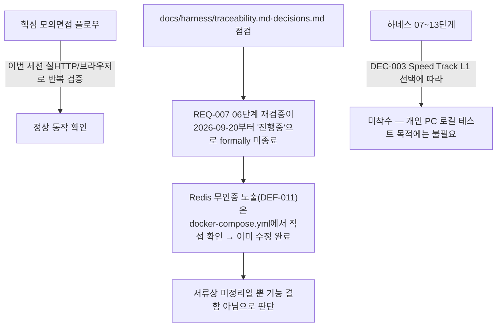

# 전체 프로젝트 상태 재점검

- **작업일**: 2026-09-24 20:10 (실제 작업 순서 기준 배치 시각, 정본은 `docs/harness/decisions.md` DEC-072)
- **관련 결정 로그**: DEC-072
- **요청 내용**: 남은 부분착수 4건(WebRTC·K8s·GDPR·STT스트리밍)을 그대로 두기로 확정 후, "아티팩트 최신화 + 더 이상 작업해야 할 부분이 없는지 전체 검토" 요청.

## 점검 결과

## 결론

사용자가 명시적으로 요청하지 않는 한 추가로 진행할 필수 작업 없음. (단, REQ-007 서류 정리는 다음 항목 `REQ007정리`로 사용자가 곧바로 요청함.)

## 영향받은 산출물

코드 변경 없음 — spec-compare 아티팩트 changelog 갱신.
