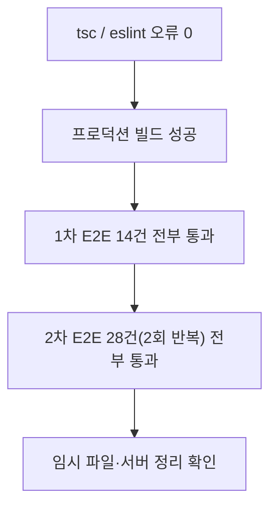

# 지원자 리포트 면접 상태 필터 추가 + 상단 탭 순서 변경

- **작업 일시**: 2026-10-07 (KST)
- **관련 DEC**: 없음 (신규 DEC 없이 화면 표시 변경)
- **상세 테스트 결과서**: `docs/harness/units/recruiter-status-filter-test.md`

## 1. 무엇을 요청받았는가

1. 채용담당자 "지원자 리포트 목록" 화면의 설명 문구 바로 아래에, 면접 상태로 조회하는 selectbox 추가 (옵션은 면접 상태 값으로 채움)
2. 상단 버튼 4개 순서를 `이력서 검토 / 지원자 리포트 / 제출 절차 안내 / 채용담당자 추가`로 변경

## 2. 무엇을 했는가

- `frontend/components/RecruiterListTabs.tsx`: 탭 배열 순서 변경 (이력서 검토 ↔ 지원자 리포트)
- `frontend/app/recruiter/page.tsx`: `면접 상태` selectbox 추가. 옵션은 전체, 예정, 진행 중, 일시중지, 완료, 만료. 서버가 준 목록을 화면에서만 거르므로 추가 API 호출이 없다. 선택한 상태의 내역이 없으면 안내 문구를 보여준다.
- `frontend/app/recruiter/recruiter.module.css`: selectbox 스타일 추가
- `frontend/e2e/recruiter-filter/status-filter.spec.ts` (신규): 14개 E2E 케이스

## 3. 검증

| 항목 | 결과 |
|---|---|
| 탭 순서 4개 | 요청한 순서와 일치 |
| 상태별 필터(예정/진행 중/완료/만료) | 건수·상태 열 모두 일치 |
| 해당 건 없음(일시중지) | 안내 문구 표시, 전체 복원 정상 |
| 필터 변경 시 API 호출 | 목록 호출 1회 유지 |
| 권한(candidate) | selectbox 없이 "권한이 없습니다" |
| 콘솔 오류 | 0건 |

개발 서버는 이 샌드박스의 HMR 문제로 화면이 멈춰 프로덕션 빌드로 검증했다(제품 코드 결함 아님).

## 4. 영향받는 파일

- `frontend/components/RecruiterListTabs.tsx`
- `frontend/app/recruiter/page.tsx`
- `frontend/app/recruiter/recruiter.module.css`
- `frontend/e2e/recruiter-filter/status-filter.spec.ts` (신규)
- `docs/harness/units/recruiter-status-filter-test.md` (신규)

## 5. 남은 일 / 참고

- 선택한 필터는 새로고침하면 "전체"로 돌아간다 (요구사항에 유지 조건 없음).
- git add/commit/push는 `CLAUDE.MD` 규칙에 따라 요청이 없어 진행하지 않았다.
