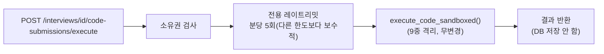

# 코드 실행 샌드박스 API 실배선 (사용자 명시 승인)

- **작업일**: 2026-09-24 14:50 (실제 작업 순서 기준 배치 시각, 정본은 `docs/harness/decisions.md` DEC-069)
- **관련 결정 로그**: DEC-069
- **요청 내용**: 사용자가 "K8s 로컬 클러스터 검증"·"코드샌드박스 API 배선" 둘 다 명시 승인("모두 진행해 주세요, 최대한 완료를 모두 하고 싶어요").

## 설계 원칙

DEC-060(보안 격리 완화 요청 거절)은 그대로 유지 — 9중 격리(네트워크 차단·읽기전용FS·비루트·capability제거·리소스제한·타임아웃+kill·`--rm`·읽기전용 코드마운트)를 전혀 건드리지 않고 API 계층만 신규 추가.

## 부수 발견

unit-29-note.md가 "이 세션 자체가 코드 실행을 플랫폼 차단한다"고 기록했던 전제를 재확인했더니, 실제로는 차단되지 않고 정상 실행됨(TC-010) — 세션/정책에 따라 달라질 수 있어 "항상 가능"을 보장하진 않는다고 명시.

## 검증 결과

| TC | 항목 | 결과 |
|---|---|---|
| TC-010 | 서비스 계층 직접 호출 | PASS |
| TC-011~012 | 실HTTP E2E, 정상 실행(Python/JS 2개 언어) | PASS |
| TC-013 | 미지원 언어 → 422 | PASS |
| TC-014 | 네트워크 격리 확인 | PASS |
| TC-015 | 타 사용자 수평권한상승 방지 → 404 | PASS |
| TC-016 | 레이트리밋 → 429 | PASS |
| TC-017 | 실 브라우저 UI(신규 탭·계정, 콘솔에러 0건) | PASS |

## 정리(규칙 K)

테스트 데이터 전부 검증 직후 삭제, 좀비 컨테이너 0건 확인.

## 영향받은 산출물

`backend/app/services/prompt_safety.py`(레이트리밋 함수 신규), `backend/app/schemas/code_submission.py`(신규), `backend/app/api/v1/code_submissions.py`(엔드포인트 신규), `frontend/app/interviews/[id]/components/CodeEditorPanel.tsx`(실행 버튼 신규), `docs/harness/units/unit-29-test.md` §11.
