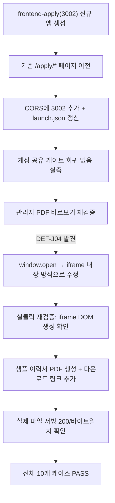

# 이력서 제출 포털 포트 3002 분리 + 4건 추가 요청 처리

- **작업 일시**: 2026-09-29 (KST)
- **관련 DEC**: DEC-100 (`docs/harness/decisions.md`)
- **관련 REQ**: REQ-040, REQ-042 (`docs/harness/traceability.md`)
- **관련 테스트 결과서**: `docs/harness/feature-j-resume-application-20260929-test.md` §11(신규)
- **관련 아티팩트**: https://claude.ai/artifact/9WauvNaQgxA57HLeNfH925 (신규, 전체 흐름 설명)

## 1. 무엇을 요청받았는가

직전 턴에서 "이력서 제출 URL이 별도 도메인/포트가 아니라 같은 서버의 다른
경로"라고 명확히 답변드렸는데, 사용자가 이를 계기로 다음을 지시했다:

1. "이력서 제출/상태 확인 포트 추가로 3002번 포트로 따로 구성해 주세요"
2. 관리자 화면에서 PDF 파일을 바로 확인할 수 있는지
3. 이력서 제출/상태 확인 화면에 샘플 양식 다운로드 기능 + 샘플 파일 신설
4. 초등학생도 이해할 수 있는 전체 흐름 다이어그램(머메이드 형식)
5. 관리자 합격/불합격 처리 시 MCP로 자동 이메일 발송 기능 여부
6. 내부테스트 진행 여부

## 2. 무엇을 했는가

### 2-1. 포트 3002 분리
`frontend-apply/`(신규 Next.js 앱, 포트 3002)를 만들고 기존
`frontend/app/apply/**`의 화면(랜딩/회원가입/로그인/이력서 제출)을
**복제가 아니라 이전**했다 — 유지보수 이원화를 피하기 위해서다. 백엔드는
그대로 공유(계정 공유 전제 유지)하고, `CORS_ORIGINS`에 3002를 추가했다.

### 2-2. PDF "바로 확인" 재검증 중 결함 추가 발견(DEF-J04)
바로 직전(DEC-099) 고쳤던 다운로드 방식("fetch로 인증 → `window.open()`")이
사실 **Chrome 팝업 차단기에 걸려 조용히 실패**하는 새로운 문제가 있었다 —
비동기 처리 뒤에 호출된 `window.open()`은 브라우저가 "사용자 동작의 직접
결과가 아니다"로 판단해 막아버린다(`window.open()`이 `null` 반환, 에러도
없음). 새 탭을 여는 방식 자체를 버리고, **같은 화면에 `<iframe>`으로 PDF를
바로 내장**하는 방식으로 근본적으로 고쳤다 — 팝업 차단과 아예 무관해지고,
사용자가 원한 "바로 확인"에도 새 탭보다 더 맞는 방식이다.

### 2-3. 샘플 이력서 양식 다운로드
실제로 읽을 수 있는 한글 이력서 양식 PDF(기본정보/학력/경력/자기소개
섹션)를 새로 만들어 `/resume` 화면에 다운로드 링크로 추가했다.

### 2-4. 전체 흐름 다이어그램
지원자 여정과 관리자 여정을 각각 머메이드 플로우차트로 그리고, 쉬운 말
설명과 화면 지도를 더해 아티팩트로 발행했다.

### 2-5. MCP 자동 이메일 발송 — 정보만 제공, 코드는 만들지 않음
직전에 이미 사용자와 확정했던 결정(반자동 — 백엔드는 이메일을 자동
발송하지 않는다)을 다시 확인시켜드렸다. 지금 있는 건 통보 초안 생성뿐이고,
이걸 완전 자동으로 바꾸려면 실제 이메일 발송 수단(SMTP 계정 또는 이메일
MCP 서버) 결정이 먼저 필요하다는 점을 정직하게 답변했다 — 물어보지 않고
임의로 새 자동발송 기능을 만들지 않았다.

## 3. 검증 결과

| 항목 | 결과 |
|---|---|
| CORS(3001/3002 모두) | PASS |
| 3002에서 만든 계정 → 3001 로그인(계정 공유 회귀) | PASS |
| 3001의 `/apply` 제거 확인 | PASS(404) |
| 3002 화면 4개 실브라우저 렌더링 | PASS |
| DEF-J04 재현 → 수정 → 재검증 | PASS |
| 샘플 이력서 다운로드 링크/파일 서빙 | PASS |
| tsc/eslint(신규 앱 + 기존 앱) | 0 에러 |

## 4. 뒷정리 (규칙 K)

- 테스트 계정 2개 + 지원서 1건 + PDF 파일 1건 삭제, `backend/var/resumes/`
  비어있음 확인
- fpdf2는 백엔드 venv가 아니라 스크래치패드 격리 디렉터리에만 설치(런타임
  의존성 영향 없음)
- 백엔드 재기동 후 `GET /api/v1/health` → `200 {"status":"ok"}` 확인(규칙 K-6)

## 5. 영향받는 파일

- `frontend-apply/**`(신규 앱 전체)
- `frontend/app/apply/**`(삭제, 이전 완료), `frontend/components/ApplyHomeLink.tsx`(삭제)
- `backend/.env`(CORS_ORIGINS에 3002 추가), `.claude/launch.json`(apply 항목 추가)
- `frontend/app/recruiter/resumes/[id]/page.tsx`(PDF 인라인 미리보기로 전환, DEF-J04 수정)
- `frontend-apply/public/sample-resume.pdf`(신규)
- `docs/harness/decisions.md`(DEC-100 신규), `docs/harness/traceability.md`
  (REQ-040/042 갱신), `docs/harness/feature-j-resume-application-20260929-test.md`(§11 추가)

git add/commit/push는 지시하신 대로 진행하지 않았습니다.
