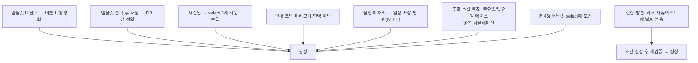

# 합격/불합격 결정 화면 — 안내문구 템플릿·일정 기본값·24시간 시간선택·필수체크 (4건)

- **작업 일시**: 2026-09-30 (KST)
- **관련 DEC**: DEC-106 (`docs/harness/decisions.md`)

## 1. 무엇을 요청받았는가

한 메시지로 4가지 요청:
1. "합격안내 문구와 불합격 안내문구 선택 할 수 있도록 수정해 주세요."
2. "면접일자는 기본으로 오늘 날짜 +7일로 지정해 주세요. (단, 토요일/일요일
   제외)(+7일이 주말때는 +7일 이후 월요일로 해 주세요)"
3. "시간 선택하는 부분은 사용하기 불편합니다. 24시 기준으로 선택할 수 있는
   화면으로 수정해 주세요."
4. "합격처리시 합격안내문 내용이 선택되었는지 체크 필수 / 불합격 처리시
   불합격안내문이 선택되었는지 체크 필수"

**착수 전 확인(AskUserQuestion, 임의 진행 금지 원칙)**: 1번은 해석이 여러
갈래라(자유텍스트 분리? 템플릿 드롭다운? 템플릿+수정 가능?) 추측하지 않고
질문 — "템플릿 드롭다운" 확정. 3번의 분 단위 간격 — "30분(00/30)" 확정.
2+3 조합 시 시간도 기본값을 줄지 — "네, 14:00도 함께" 확정.

## 2. 무엇을 했는가

`frontend/app/recruiter/resumes/[id]/page.tsx` 전면 수정.

- **①** 공용 자유텍스트 1칸 → `합격 안내 문구`/`불합격 안내 문구` 드롭다운
  2개로 분리(각 3종 초안 문구, `ACCEPT_TEMPLATES`/`REJECT_TEMPLATES` 배열만
  바꾸면 문구 교체 가능). 과거 자유텍스트 값은 목록에 없으면 임시 옵션으로
  추가해 원본 보존.
- **②** `defaultInterviewDate()`: 오늘+7일 계산 후 토/일이면 다음 월요일로
  보정. 타임존 버그(`toISOString()`이 UTC로 바꿔 날짜가 하루 밀리는 문제)를
  피하려 로컬 연/월/일을 직접 조합하는 `formatLocalDate()` 사용.
- **③** 네이티브 `<input type="time">`(오전/오후 스피너) → 시(00~23)/분
  (00,30) 드롭다운 2개로 교체. 내부적으로는 기존과 동일한 "HH:MM" 문자열로
  합쳐 관리해 저장 형식은 그대로.
- **④** "합격 처리"는 `합격 안내 문구 미선택` 또는 `일정 날짜/시간 불완전`
  이면 비활성화. "불합격 처리"는 `불합격 안내 문구 미선택`일 때만
  비활성화 — 면접 일정은 합격에만 의미가 있다고 판단해 불합격은 일정
  상태와 무관하게 처리 가능하도록 분리(사용자가 명시하지 않았으나 자연스러운
  논리적 귀결로 판단, 이 보고서로 명시).

## 3. 검증 중 발견한 실제 결함 — 즉시 수정 (숨기지 않고 보고)

최초 구현은 "기존 파싱된 날짜/시간이 둘 다 비어있으면 기본값 채움"
(`!parsed.date && !parsed.time`) 조건이었는데, 이 조건은 **"한 번도 설정한
적 없음"과 "과거 자유 텍스트라 새 형식으로 파싱이 안 됨"을 구분하지 못했다.**
실측 중 과거 자유텍스트 메모("다음 주 중 편한 시간에 연락 부탁드립니다.")가
있는 이력서를 열어보니, 여기에 **지어낸 기본 날짜(+7일)가 조용히 붙어버리는
결함**을 발견했다 — 실제로 정해진 적 없는 날짜가 화면에 나타나는 것은
사용자에게 잘못된 정보를 보여주는 것이라 판단해, 조건을
`!d.interview_schedule_note`(DB 원본 자체가 비어있을 때만)로 즉시 정정하고
재검증했다.

## 4. 검증 — 전부 실브라우저 + DB 직접 조회로 실측

| 시나리오 | 결과 |
|---|---|
| 날짜만 있고 템플릿 미선택 | 두 버튼 모두 비활성화 |
| 합격 템플릿 선택 + 시16:30 저장 | DB: `2026-10-07(수) 16:30` + 선택한 템플릿 문구 |
| 재진입 | 합격 select·시(16)·분(30)·날짜 전부 정확히 복원 |
| 안내 초안 미리보기 | "면접 일정 안내: 2026-10-07(수) 16:30" + 선택 문구 그대로 반영 |
| 불합격 템플릿만 선택 후 불합격 처리 | 합격 버튼은 비활성 상태 그대로, 불합격은 정상 처리, `interview_schedule_note`는 NULL로 저장(일정 미관련 확인) |
| 주말 스킵 — 강제 시뮬레이션 | +7일이 토요일이 되는 기준일, 일요일이 되는 기준일 둘 다 다음 월요일로 정확히 보정 |
| 분 45(00/30 목록에 없는 과거값) | select 목록 맨 앞에 "45"가 임시 옵션으로 추가되어 값 보존 |
| 과거 자유텍스트(파싱 불가) 메모 | (결함 발견 전) 지어낸 날짜 붙음 → (수정 후) 날짜 빈칸, 메모 원문 그대로 보존 |

## 5. 뒷정리 (규칙 K) + 헬스체크 (규칙 K-6)

- 테스트에 사용한 이력서 신청 1건을 `pending`/모든 판단 필드 `NULL`로 원복.
- `GET /api/v1/health` → `200 {"status":"ok"}`, 상세 페이지 → `200`.

## 6. 영향받는 파일

- `frontend/app/recruiter/resumes/[id]/page.tsx`
- `docs/harness/decisions.md` (DEC-106 신규)

git add/commit/push는 지시하신 대로 진행하지 않았습니다.
