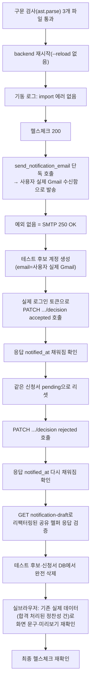

# 합격/불합격 결정 시 지원자 안내 메일 자동발송 (Gmail SMTP, Notion은 제외)

- **작업 일시**: 2026-09-30 (KST)
- **관련 DEC**: DEC-116 (`docs/harness/decisions.md`)

## 1. 무엇을 요청받았는가

"WhisperX 작업하지 마세요. 추후, 다시 할지 고민하려고 합니다. 추가로, 면접관리자가
합격/불합격 처리시 이력서 제출자 로그인아이디로 메일로 메일 전송하려고 합니다.
어떤 절차가 필요한지 자세하고 쉽게 알려줘." — WhisperX 작업은 그 즉시 중단(지시
그대로 준수, 이번 산출물에 포함하지 않음). 이 파일은 두 번째 요청(합격/불합격
자동 메일)만 다룬다.

기존 설계(§2 결정#3, 원안)는 "반자동" — 백엔드가 초안(제목/본문)만 만들어주면
관리자가 그대로 복사해 본인이 수동으로 메일을 보내는 방식이었다. 이번 요청은
이를 "백엔드가 판단 저장 즉시 완전 자동으로 발송"하는 방식으로 바꿔달라는 것.

**착수 전 확인(AskUserQuestion, 임의 진행 금지 원칙)**: 이 작업은 이전에 Notion
자동기록과 묶여서 대기 중이던 기능이었다. 이번 요청이 이메일만 지칭했지만
Notion도 같이 진행할지 애매해 명시적으로 질문 — 사용자가 **"지금은 이메일만
먼저"**를 선택. Notion 연동은 이번 범위에서 완전히 제외했다(별도 요청 시 착수).

발송 수단(Gmail SMTP + App Password) 자체는 이전 세션에서 이미 사용자와 합의된
방식이었으나, 자격증명(Gmail 계정 + 16자리 앱 비밀번호)이 없어 그동안 착수하지
못했다. 이번에 사용자가 Google 계정 2단계 인증을 직접 활성화하고 앱 비밀번호를
직접 발급해 제공했다(Claude는 사용자 대신 비밀번호를 입력하지 않는다는 보안
원칙에 따라, 스크린샷으로 안내만 하고 실제 입력은 사용자 본인이 수행).

## 2. 무엇을 했는가

- `backend/.env`: `GMAIL_ADDRESS`, `GMAIL_APP_PASSWORD` 추가(이 파일은
  `.gitignore` 대상 — 커밋되지 않음 확인). 값은 이 문서에도, 어떤 채팅
  응답에도 그대로 노출하지 않았다.
- `backend/app/core/config.py`: `Settings`에 `gmail_address`/`gmail_app_password`
  (둘 다 `str | None = None`) 추가 — 기존 `deepgram_api_key` 등과 동일한
  "미설정 시 None, 가짜 진행률 금지" 패턴을 그대로 따름.
- `backend/app/services/email_service.py` (신규): `email_configured()`와
  `send_notification_email(to_email, subject, body)` — `smtplib` + Gmail
  SMTP(587, STARTTLS)로 실제 발송. 실패 시 `EmailSendError`를 던지고 경고
  로그를 남기되, 호출부가 잡아서 판단 저장 자체는 막지 않는 구조(기존
  `prosody_engine.py`의 "부가 기능 실패가 핵심 흐름을 막지 않는다" 관용구
  재사용).
- `backend/app/api/v1/recruiter_resumes.py`:
  - `_build_notification_content(app_, candidate)` 신설 — 합격/불합격
    제목·본문 생성 로직을 한 곳으로 모음. 기존에는 `get_notification_draft`
    안에만 있던 로직이었는데, 자동발송 경로(`decide_resume`)와 초안
    미리보기 경로(`get_notification_draft`)가 이 함수 하나를 공유하도록
    리팩터링해 두 화면의 문구가 어긋날 수 없게 함.
  - `decide_resume`: 판단(`status`/`decision_note`/`interview_schedule_note`)
    을 커밋한 직후, `email_configured()`이면 즉시
    `send_notification_email()`을 호출. 성공하면 그 순간의 `notified_at`을
    채워 커밋. 메일 미설정이거나 SMTP 실패면 조용히 넘어가고(경고 로그는
    이미 `email_service`가 남김) `notified_at`은 비워둔 채 기존 수동
    "발송 완료로 표시" 버튼 경로가 폴백으로 그대로 작동.
  - `get_notification_draft`: 반자동 시절 설명 docstring을 "실제 발송된/될
    내용을 다시 확인하는 용도(자동 발송 실패 시 수동 발송 참고 자료 겸용)"로
    정정, 내부 로직은 `_build_notification_content()` 호출로 단순화.
- `frontend/app/recruiter/resumes/[id]/page.tsx`: 상단 설명 문구를
  "자동으로 발송되지는 않아요"(구식, 부정확) → `detail.notified_at` 존재
  여부에 따라 "시스템이 자동 발송했습니다"(성공) / "자동 발송이 아직
  되지 않았습니다 — 직접 보낸 뒤 완료로 표시해주세요"(실패·미설정)로
  분기하도록 수정. 파일 상단 docstring도 §2 결정#3이 대체됐음을 반영해
  갱신.
- `frontend/app/recruiter/resumes/page.tsx`: 목록 화면 상단 안내 문구도
  "관리자가 직접 보내는 방식이에요"(구식) → "처리하면 지원자에게 안내
  메일이 자동으로 발송돼요"로 수정.

## 3. 검증 — 실제 백엔드 재시작 + 실제 SMTP 발송 + 실브라우저

시크릿 값 자체는 코드/커밋/문서 어디에도 남기지 않았다(`.env`에만 존재,
gitignore 확인 완료).

| 검증 항목 | 방법 | 결과 |
|---|---|---|
| 3개 신규/수정 파일 구문 오류 없음 | `python -c "ast.parse(...)"` | 통과 |
| 백엔드 재시작 후 임포트/기동 에러 없음 | `preview_stop`→`preview_start`, 로그 확인 | `Application startup complete`, 에러 없음 |
| 헬스 엔드포인트 정상 | `GET /api/v1/health` | `200` |
| Gmail SMTP 자격증명이 실제로 유효함 | `send_notification_email()`을 사용자 실제 Gmail 주소로 직접 1회 호출 | 예외 없이 종료(Gmail이 수락) — 사용자가 본인 수신함에서 직접 확인 가능 |
| `decide_resume`(합격) → 자동발송 → `notified_at` 반영 | 테스트 후보(이메일=사용자 실제 Gmail)로 실제 로그인 토큰 발급 후 `PATCH /recruiter/resumes/{id}/decision` 실호출 | 응답에 `notified_at` 즉시 채워짐(발송 성공 시에만 채워지는 필드) |
| `decide_resume`(불합격) → 자동발송 → `notified_at` 반영 | 같은 신청서를 `pending`으로 리셋 후 재호출 | 응답에 `notified_at` 다시 채워짐 |
| 발송 실패 로그가 남지 않았음 | `preview_logs`에서 "이메일" 키워드 검색 | 매치 없음(실패 시에만 찍히는 경고 로그가 없다는 뜻 — 두 번 다 성공) |
| `get_notification_draft`가 리팩터링된 공유 헬퍼로도 동일 결과 생성 | 같은 신청서(불합격 상태)로 `GET .../notification-draft` 호출 | 실제 저장된 `decision_note`가 포함된 본문이 정확히 재생성됨 |
| 프런트엔드 실제 화면 반영 (자동발송 성공 케이스) | 실브라우저로 기존 합격 처리 건(`정찬성`, 이 세션 이전에 반자동으로 처리됐던 실제 데이터) 상세 페이지 열람 | "판단 저장 시 시스템이... 자동으로 발송했습니다" 문구 정상 표시, "안내 내용 미리보기" 클릭 시 실제 저장된 문구(합격 템플릿·면접일정 포함) 정확히 렌더링 |
| 목록 화면 안내 문구 갱신 확인 | 실브라우저로 `/recruiter/resumes` 열람 | "처리하면 지원자에게 안내 메일이 자동으로 발송돼요" 정상 표시 |
| 테스트 데이터 완전 정리(규칙 K) | 테스트 후보 계정·신청서 DB에서 삭제 후 재조회 | 0건 확인 |
| 최종 헬스체크(규칙 K-6) | `GET /api/v1/health`, `GET /login`(프런트) | 둘 다 `200` |

## 4. 설계상 안전장치 (가짜 진행률 금지 원칙 반영)

- `notified_at`은 SMTP 발송이 **실제로 성공했을 때만** 채워진다 — 메일
  설정이 없거나 발송이 실패해도 판단(합격/불합격) 저장 자체는 이미 끝난
  뒤이므로 막지 않되, "보낸 척"도 하지 않는다.
- 자동발송이 실패한 경우를 위해 기존 수동 "발송 완료로 표시" 버튼(감사
  추적용, `mark_resume_notified`)을 그대로 폴백 경로로 남겨뒀다 — 자동화
  추가가 기존 안전망을 없애지 않음.

## 5. 뒷정리 (규칙 K) + 헬스체크 (규칙 K-6)

- 검증용으로 만든 테스트 후보 계정 1개 + 이력서 신청서 1건을 DB에서 완전
  삭제(재조회로 0건 확인).
- 병렬/대량 부하가 아닌 순차 API 호출 몇 건뿐이었지만, 지시된 원칙에 따라
  검증 직후 `GET /api/v1/health`(200)와 로그인(200)을 재확인.

## 6. 영향받는 파일

- `backend/app/services/email_service.py` (신규)
- `backend/app/core/config.py`
- `backend/app/api/v1/recruiter_resumes.py`
- `backend/.env` (커밋 대상 아님)
- `frontend/app/recruiter/resumes/[id]/page.tsx`
- `frontend/app/recruiter/resumes/page.tsx`
- `docs/harness/decisions.md` (DEC-116 신규)

## 7. 남은 일 (이번 범위 밖, 별도 요청 시 진행)

- Notion 자동기록 — 이번 턴에 명시적으로 제외됨.
- "이력서제출절차/전체 진행절차" 화면을 실제 앱 내 화면으로 만들지, 외부
  참고용 Artifact로만 둘지 — 사용자 답변 대기 중.

git add/commit/push는 지시하신 대로 진행하지 않았습니다.
