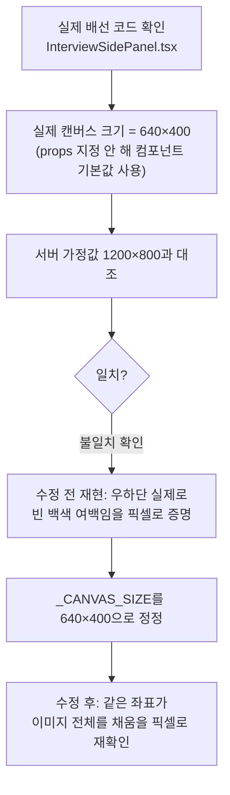

# 화이트보드 AI 분석 캔버스 크기 불일치 정정 (unit-35 후속)

- **작업일**: 2026-09-28 13:35 (KST)
- **관련 결정 로그**: DEC-081
- **요청 내용**: 사용자가 승인한 "나머지 6개 후보" 중 #6 — "화이트보드
  `_CANVAS_SIZE` 프론트 실측 대조" 진행

## 배경

화이트보드에 그린 그림을 AI(SmolVLM)에게 보여주려면 먼저 좌표를 실제 이미지로
그려야(렌더링) 한다. 이때 서버는 "캔버스가 1200×800 크기"라고 가정하고
그려왔는데, unit-35 당시 이 가정을 실제 화면 코드와 대조해본 적이 없었다.

## 한 일

실제로 화면에 쓰이는 코드를 직접 읽어 "그림이 그려지는 진짜 크기"를 확인하고,
서버 설정값과 비교했다. 예상대로 서로 달랐다(비율까지 다름) — 그림이 화면
좌상단 절반 정도에만 작게 그려지고 나머지 절반 이상이 빈 백색 여백으로 AI에게
전달되고 있었던 것이다. 이미 AI 응답 품질이 낮은 상태(unit-35 기존 기록)에서
이 문제가 상황을 더 나쁘게 만들고 있었다.

## 검증

수정 전 값으로 다시 그려보니 실제로 우하단이 비어 있음을 픽셀 값으로 확인했고
(회귀 증거), 수정 후에는 같은 그림이 이미지 전체를 채우는 것도 픽셀로 재확인
했다. 자세한 결과는 `docs/harness/whiteboard-canvas-size-20260928-test.md` 참고.

## 영향받은 산출물

`backend/app/services/whiteboard_vision.py`, `docs/harness/units/unit-35-note.md`
(§5-1 해소), `docs/harness/units/unit-35-test.md`(§8 갱신), `docs/harness/
traceability.md`(REQ-021), `docs/harness/decisions.md`(DEC-081), `docs/harness/
whiteboard-canvas-size-20260928-test.md`(신규).
