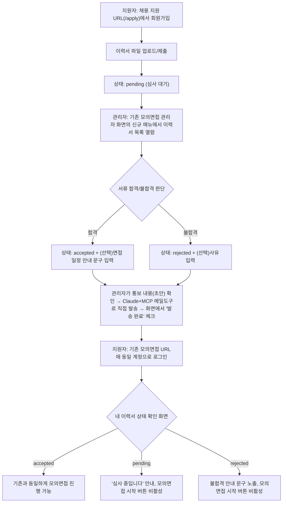

# [신규 기능 요청 프롬프트] 이력서 제출 → 서류 합격/불합격 → 모의면접 진행 플로우

- 작성일: 2026-09-29 (KST)
- 작성자: 사용자 요청을 받아 이 세션이 20년차 개발/기획/설계/보안/디자인 담당자
  기준으로 정리한 **구현 착수용 프롬프트**다. 이 문서 자체는 아직 코드를 만들지
  않았다 — 다음에 이 문서를 Claude Code에게 그대로 전달(또는 이 저장소를 여는
  새 세션의 최초 메시지로 사용)하면 그 세션이 이 내용을 기준으로 구현을
  시작한다.
- **이 문서를 받는 Claude Code 세션에게**: 이 저장소에는 `CLAUDE.md` →
  `ORCHESTRATOR.md`로 이어지는 13단계 개발 하네스가 이미 적용 중이다. 이
  프롬프트를 실행하기 전에 반드시 그 두 문서(특히 규칙 A/E/K)를 먼저 읽고,
  아래 "8. 하네스 진행 방식" 절의 지시를 그대로 따를 것. **로컬 서버까지만
  진행하고, git add/commit/push는 사용자가 그 시점에 명시적으로 요청하기 전엔
  절대 하지 않는다**(CLAUDE.md 고정 규칙, 이 문서가 우회하지 않는다).

---

## 1. 왜 필요한가 (배경)

지금까지의 "AI 모의면접 플랫폼"은 지원자가 **모의면접 URL에 바로 회원가입해서
모의면접을 보는** 단일 흐름이었다. 이번 요청은 그 앞단에 **실제 채용 전형과
비슷한 서류 심사 단계**를 추가하는 것이다:

1. 지원자는 **모의면접 URL이 아닌 별도의 "채용 지원" URL**에서 회원가입하고
   이력서를 제출한다.
2. 채용담당자(관리자)는 **기존 모의면접 시스템의 관리자 화면**에 새로 생긴
   메뉴에서 제출된 이력서들을 열람하고 서류 합격/불합격을 판단한다.
3. 판단 결과(합격/불합격 둘 다)는 관리자가 **MCP 기반 메일 발송 도구**를 통해
   해당 지원자의 등록 이메일로 개별 통보한다. 합격자에게는 **면접 일정(안내용
   정보)**도 함께 알려줄 수 있다.
4. 합격 통보를 받은 지원자는 **기존 모의면접 URL**에 (지원 시 쓴 것과 같은
   계정으로) 로그인해서 본인의 합격 여부를 화면에서 확인한 뒤, 지금과 동일한
   방식으로 실제 모의면접을 진행한다.

## 2. 확정된 설계 결정 4가지 (사용자 답변, 재질문 금지 — 이 부분은 이미 확정됨)

구현에 들어가기 전 이 세션이 사용자에게 직접 확인받은 사항이다. **아래 4가지는
다시 묻지 말고 그대로 따른다**:

| # | 질문 | 확정된 답변 |
|---|---|---|
| 1 | 이력서 제출 시스템을 어떤 형태로 만들 것인가 | **같은 저장소, 새 경로/포트로 추가** — 완전히 별도의 새 프로젝트(별도 repo)로 분리하지 않는다. 기존 `backend`/`frontend` 코드베이스를 그대로 확장한다. |
| 2 | 이력서 제출자 계정과 모의면접(candidate) 계정이 같은가 | **계정 공유** — 같은 이메일/비밀번호로 양쪽 다 로그인 가능해야 한다. 별도 계정 체계나 자동 이관 로직은 만들지 않는다. |
| 3 | "MCP로 합격/불합격 통보"가 의미하는 방식 | **반자동** — 백엔드가 SMTP 등으로 이메일을 자동 발송하는 기능은 만들지 않는다. 관리자 화면은 "발송할 내용(수신자 이메일·제목·본문 초안)"까지만 준비해서 보여주고, 실제 이메일 발송은 관리자가 Claude+MCP 메일 도구(예: Gmail MCP 등, 구체적인 도구는 이 세션 범위 밖)로 별도 수행한다. 화면에는 "발송 완료로 표시" 같은 상태 체크만 있으면 된다. |
| 4 | 관리자가 등록하는 "면접 일정"의 강제력 | **안내용 정보만** — 실제 모의면접 시작 가능 시점을 제한하지 않는다. 기존 `interviews`/상태머신 로직은 건드리지 않는다. 합격자는 등록된 일정과 무관하게 로그인 즉시 모의면접을 시작할 수 있다. |

## 3. 전체 플로우

## 4. 상세 요구사항

### 4-1. 지원자용 "채용 지원" 포털 (신규 경로)

- **권장 구현 방식**: 기존 `frontend`(Next.js) 앱 안에 새 경로 세그먼트를
  추가한다 — 예: `/apply/register`, `/apply/login`, `/apply/resume`. 사용자가
  요구한 "다른 URL"은 **다른 경로(path)** 만으로 충분히 충족된다(예:
  `http://localhost:3001/apply/...`). 완전히 별도의 두 번째 Next.js 인스턴스를
  새 포트로 띄우는 방식은 배포/의존성 관리 복잡도만 늘리고 얻는 이점이 없다고
  판단한다.
  - **단, 이 판단에 확신이 없다면 반드시 사용자에게 재확인할 것** — 예를 들어
    "완전히 다른 도메인(예: apply.company.com)으로 마케팅/채용 페이지를 별도
    운영할 계획"이라면 방식이 달라진다. 위 표의 결정 #1은 "같은 저장소"까지만
    확정된 것이고, "같은 앱의 새 경로" vs "같은 저장소 내 별도 Next.js 앱(새
    포트)"은 이 문서가 임의로 좁힌 해석이다 — 착수 직전 한 번 더 확인 권장.
- 화면 구성(최소):
  1. 회원가입 화면 — 기존 `frontend/app/register/page.tsx`와 동일한 UX/스타일
     ("현재 프로젝트와 동일한 형태로"라는 사용자 요구 그대로), 기존
     `POST /auth/register` 엔드포인트를 그대로 재사용(`role: "candidate"`
     고정, 별도 role 신설 불필요 — 이력서 제출자는 결국 모의면접 candidate와
     동일 인물이다).
  2. 로그인 화면 — 기존 `frontend/app/login/page.tsx`와 동일 UX, 기존
     `POST /auth/login` 그대로 재사용.
  3. 이력서 제출 화면 — 로그인 후 접근. 파일 업로드(형식/용량 제한은 아래
     4-3 참고) + 자기소개/지원동기 등 텍스트 필드(선택, 필요 최소한으로).
     제출 후에는 "심사 중입니다" 상태 화면으로 전환.
- **개인정보 처리 원칙 — 이 프로젝트의 기존 컴플라이언스 패턴을 그대로 따를
  것**: 이 저장소는 이미 `ConsentType`(현재 `biometric_voice`,
  `ai_interview_notice`) 기반의 사전 동의 체계(unit-14/15, REQ-029~034)와
  개인정보 보호법 제37조의2 대응 문구 체계(`complianceContent.ts`)를 갖추고
  있다. 이력서(민감할 수 있는 개인정보 덩어리: 경력·학력·연락처 등)를 새로
  수집하므로, **동일한 패턴으로 신규 `ConsentType`(예: `resume_submission`)을
  추가하고 이력서 제출 전 사전고지+동의 체크박스를 반드시 거치게 할 것** —
  임의로 생략하지 말 것(이 프로젝트의 기존 09단계 보안검증 기준에도 어긋남).

### 4-2. 관리자(채용담당자) 이력서 검토 화면 — 기존 URL의 신규 메뉴

- 기존 `frontend/app/recruiter/page.tsx`(현재 `/recruiter` 대시보드, "채용담당자
  리포트 열람" 화면)에 **신규 메뉴/탭으로 "이력서 검토"를 추가**한다. 새 화면
  경로 제안: `frontend/app/recruiter/resumes/page.tsx`(목록),
  `frontend/app/recruiter/resumes/[id]/page.tsx`(상세+판단).
  - **권한**: 기존 `recruiter` role 그대로 사용(신규 role 불필요) — 이
    프로젝트는 이미 `/recruiter`가 recruiter 전원 전체 열람 정책(단일조직
    가정, §6.1)이므로 이력서도 동일 정책을 따르는 것이 자연스럽다. 다만 이
    부분은 실제 구현 착수 시 "이력서도 정말 recruiter 전원이 다 봐도 되는지,
    아니면 담당자별로 나눠야 하는지"를 짧게 재확인할 것(개인정보 민감도가
    평가 리포트보다 높을 수 있음).
- 목록 화면: 지원자 이름/이메일/제출일시/현재 상태(pending/accepted/rejected)
  표시, 상태별 필터.
- 상세 화면: 이력서 파일 열람/다운로드, 판단 UI(합격/불합격 버튼 + 사유 또는
  안내 문구 입력란 + "면접 일정(안내용 텍스트, 자유 형식 또는 날짜 선택
  위젯)" 입력란), 저장 시 상태 전이.
- **통보 초안 생성**: 판단을 저장하면(합격이든 불합격이든) 화면에 "통보
  내용 미리보기"를 보여준다 — 수신 이메일, 제목, 본문(합격/불합격 여부 +
  합격 시 면접 일정 안내 문구 + 모의면접 URL 안내 포함). 관리자가 이 내용을
  복사하거나, 그대로 보면서 본인의 MCP 메일 도구로 발송한다. 발송 후 관리자가
  화면에서 "통보 완료" 버튼을 눌러 `notified_at` 같은 타임스탬프를 남긴다
  (감사 추적용 — 이 프로젝트 전반의 "실제로 한 일만 완료로 표시" 원칙과
  일치).

### 4-3. 데이터 모델 제안 (최종 스키마는 03-설계 단계에서 확정)

신규 테이블 제안 — 가칭 `RESUME_APPLICATIONS` (기존 `app/models/*.py` 명명
관례를 따라 `resume_application.py`):

| 필드 | 타입(제안) | 비고 |
|---|---|---|
| id | UUID PK | |
| candidate_id | UUID FK → users.id | 계정 공유(결정#2)이므로 기존 users 재사용 |
| file_path / file_ref | text | 실제 파일은 디스크(`backend/var/resumes/` 등 기존 `var/` 패턴 참고) 또는 별도 스토리지에 저장, DB에는 참조만 |
| original_filename | varchar | |
| content_type | varchar | PDF 등 화이트리스트 제한 권장 |
| file_size_bytes | integer | 업로드 용량 제한 필요(기존 `MAX_VOICE_UPLOAD_BYTES` 패턴 참고) |
| status | enum(pending/accepted/rejected) | |
| decision_note | text nullable | 합격 시 안내문구 또는 불합격 사유 |
| interview_schedule_note | text nullable | **안내용일 뿐 강제력 없음**(결정#4) |
| reviewed_by | UUID FK → users.id nullable | 판단한 recruiter |
| reviewed_at | timestamptz nullable | |
| notified_at | timestamptz nullable | 관리자가 "통보 완료"로 수동 표시한 시각 |
| submitted_at | timestamptz | |

- 이력서 원문(PDF 등)에 담긴 개인정보 보호 수준은 최소한 기존 `EncryptedText`
  패턴(DEC-078, `content_text`/`code_submissions.content`에 이미 적용된
  AES-256-GCM)에 준하는 보호가 필요한지 검토할 것 — 파일 자체를 암호화
  저장할지, 접근 제어(관리자만 다운로드 가능)로 충분할지는 03-설계 단계에서
  실제 법적/보안 기준(개인정보 보호법)에 맞춰 결정.
- **보관기간**: 이 프로젝트는 이미 `transcript`/리포트에 180일 보관기간
  정책(REQ-033, `purge_expired_data` 배치)을 두고 있다. 이력서도 동일한
  보관기간 정책 대상에 포함할지, 별도 기간을 둘지 결정 필요(채용 관련
  서류는 통상 더 긴 보관이 요구되는 경우도 있음 — 법적 판단 필요 시 기존
  GDPR/CCPA 대응 사례처럼 "법률 검토 필요" 고지로 남길 것).

### 4-4. API 제안

- `POST /apply/resumes` (또는 기존 컨벤션에 맞춰 `POST /resumes`) — 로그인한
  candidate가 본인 이력서 제출(multipart). 이미 있으면 재제출/갱신 정책도
  결정 필요(새 버전으로 덮어쓸지, 이력을 남길지).
- `GET /users/me/resume-status` — 로그인한 사용자가 본인의 현재 심사 상태를
  조회(모의면접 URL의 홈 화면이 이 값을 보고 게이트 여부를 결정, 4-5 참고).
- `GET /recruiter/resumes`, `GET /recruiter/resumes/{id}` — 관리자 목록/상세
  (기존 `recruiter.py` 컨벤션과 401/403/404 에러 패턴을 그대로 따를 것).
- `PATCH /recruiter/resumes/{id}/decision` — 합격/불합격 판단 저장.
- `POST /recruiter/resumes/{id}/mark-notified` — "통보 완료" 수동 체크.

### 4-5. 모의면접 URL 쪽 게이트 — **구현 착수 전 반드시 재확인할 사항**

지원자가 합격 통보를 받은 뒤 **기존 모의면접 URL**에 로그인하면 "합격 여부를
확인"하게 된다는 것이 사용자 요구사항이었다. 즉 로그인 직후 홈 화면(기존
`frontend/app/page.tsx`, `CandidateHome`)에서 본인의 이력서 심사 상태를 보여주고,
`status !== 'accepted'`인 동안은 "새 면접 시작" 버튼을 막아야 자연스럽다.

**단, 이 부분은 이 문서가 임의로 정하지 않은 진짜 열린 질문이 하나 있다 —
구현 착수 세션은 반드시 사용자에게 다시 확인할 것**:

> 이 기능이 배포된 **이후** 새로 가입하는 지원자는 위 흐름(이력서 → 심사 →
> 합격)을 거쳐야 하는 게 명확하다. 그런데 **이 기능 도입 이전부터 이미 존재하던
> candidate 계정**(이 세션이 테스트용으로 만든 계정들 포함, 그리고 실제로
> 이 서비스를 이력서 절차 없이 바로 써온 기존 사용자가 있다면 그 계정)은
> `RESUME_APPLICATIONS` 레코드가 아예 없다. 이런 계정도 모의면접 시작을
> 막아야 하는가, 아니면 "이력서 기록이 없으면 게이트하지 않고 기존처럼 자유롭게
> 진행 허용(하위호환)"으로 처리해야 하는가?
>
> 이 문서는 잠정적으로 **후자(하위호환 — 이력서 기록이 없으면 게이트 없이 기존
> 동작 유지, 이력서 기록이 있을 때만 그 상태를 따름)** 를 기본값으로 제안한다
> — 근거: 기존 데이터/테스트 계정을 깨뜨리지 않는 게 안전하고, 사용자의
> 요구사항 설명도 "합격 통보받은 사람"이 대상이지 "모든 기존 사용자"를
> 소급 적용한다는 언급은 없었기 때문이다. **그러나 이것이 사용자의 실제
> 의도(예: 이제부터는 이력서 없이는 아무도 모의면접을 못 보게 완전히 막고
> 싶을 수도 있음)와 다를 수 있으므로, 구현에 들어가기 직전 이 한 가지만
> 사용자에게 짧게 재확인할 것.**

## 5. 이번 범위에 포함하지 않는 것 (Out of Scope, 명시적 확인 완료)

- 백엔드의 실제 이메일 자동 발송(SMTP/이메일 API 연동) — 결정#3에 따라
  반자동(수동 MCP 발송)이므로 이번 범위 아님.
- 면접 일정에 의한 모의면접 시작 시점 강제 제한 — 결정#4에 따라 안내용
  정보로만 저장.
- 이력서 제출자 전용 새 role/권한 체계 — 결정#2에 따라 기존 candidate role
  그대로 사용.
- 완전히 별도의 배포/저장소 — 결정#1에 따라 기존 저장소 확장.

## 6. 기존 시스템과의 통합 시 지켜야 할 것 (회귀 방지)

- 기존 `POST /auth/register`/`POST /auth/login`, JWT 인증 로직은 절대
  변경하지 말고 그대로 재사용할 것 — 계정 공유(결정#2)의 전제조건이다.
- 기존 `/recruiter` 대시보드의 기존 기능(리포트 열람)에 회귀가 없어야 한다 —
  새 메뉴 추가는 additive여야 함.
- 기존 `CandidateHome`(`frontend/app/page.tsx`)에 게이트 로직을 추가할 때,
  기존 "새 면접 시작"/"최근 면접" 렌더링 로직을 깨뜨리지 않을 것 — 04-ux 설계
  문서의 기존 [C-03] 화면 명세와 최대한 additive하게 통합.
- 이 프로젝트가 이미 갖춘 새니타이즈/암호화/감사로그(REQ-036/037/039 등)
  원칙을 이력서 관련 신규 입력 필드(특히 자유 텍스트: 자기소개, 판단 사유,
  일정 안내 문구)에도 동일하게 적용할 것.

## 7. 명명 제안 (참고용 — 실제 번호는 구현 시점의 `docs/harness/traceability.md`
   최신 상태를 다시 확인해서 배정할 것)

- 이 문서 작성 시점 기준 마지막 REQ 번호는 REQ-039, 마지막 unit은 unit-37이다.
- 신규 Feature 그룹(가칭 **Feature J — 채용 지원(이력서) 심사**)으로 두고,
  REQ-040 이후 번호대·unit-38 이후 번호를 이어서 쓰는 것을 제안한다(최종
  확정은 실제 작업 착수 시점의 파일 상태 기준).

## 8. 하네스 진행 방식 (이 저장소의 표준 절차 — 반드시 준수)

1. **먼저 이 문서를 사용자와 함께 검토**하고, 4-5절의 열린 질문(하위호환 여부)을
   포함해 남은 불확실한 지점을 확인한다 — 규칙 A(모르면 질문, 임의 진행 금지).
2. 확인이 끝나면 02-planning 수준의 간단한 갱신(또는 이 문서 자체를 그 역할로
   대체 가능한지 사용자와 상의) → 03-system-design에 신규 테이블/엔드포인트
   반영 → 04-ux-design에 신규 화면([C-15] 채용 지원 회원가입/로그인/이력서
   제출, [R-04] 이력서 검토, 기존 [C-03] 게이트 로직 갱신 등) 반영 →
   05단계부터 작업 단위(unit)로 쪼개 순차 구현.
3. **DEC 로그(`docs/harness/decisions.md`)에 이 기능 도입 자체를 새 DEC로
   기록**하고, `traceability.md`에 신규 REQ 행을 추가한다.
4. 매 작업 단위 완료 시 `개발작업내용/` 폴더에 결과 로그를 남기고, "모의면접
   스펙 비교" 아티팩트도 CLAUDE.md의 표준 규칙대로(사용자에게 매번 묻지 않고)
   자동 갱신한다.
5. **git add/commit/push는 절대 자동으로 하지 않는다** — 사용자가 그 시점에
   명시적으로 요청할 때만 수행(CLAUDE.md 고정 규칙).
6. 로컬 검증(백엔드/프런트/필요 시 Celery 워커)까지만 진행하고, 실제
   배포(12단계)는 사용자의 명시적 승인 없이 진행하지 않는다(규칙 E).
